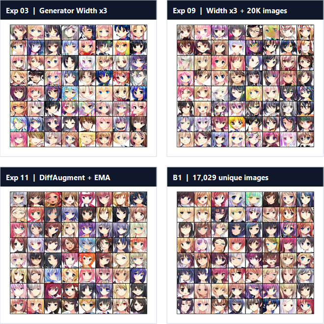

# Resource-Constrained DCGAN for Anime-Face Generation


> This repository is a curated public snapshot of an ongoing DCGAN internship project. The experiments were run in Kaggle, while the active research workspace remains separate. The snapshot is designed for technical review and interview discussion; it is not a claim of a locally reproducible or state-of-the-art generator.

## Reviewer summary

The project studies unconditional 64x64 anime-face generation with PyTorch under limited GPU and batch-size constraints. The main research question was which changes improve the adversarial game most reliably:

- discriminator stabilization with spectral normalization and Hinge loss;
- generator capacity scaling;
- data scaling from 10K to 20K images;
- DiffAugment and exponential moving average (EMA);
- CLIP image-feature distribution matching with an MMD objective.

The strongest project-level lesson is that data scale and adversarial stabilization were more reliable than repeatedly adding generator modules. The CLIP sweep is preserved as a controlled continuation study, not as proof that CLIP caused the entire downstream FID reduction.

The follow-up data audit also found that 21,551 image paths contained only 17,029 unique SHA-256 contents. The new B1 formal baseline makes that data-quality issue explicit before the planned SDXL-mixture study.

## Full experiment process

This repository records the full progression, not only the final FID milestones:

| Stage | What was tested | Evidence and source |
|---|---|---|
| Phase 1 | Epoch budget and early image augmentations | [`phase1_preliminary_tuning`](03_metrics_and_logs/phase1_preliminary_tuning/) ? [`early tuning scripts`](02_selected_experiments/full_process/phase1_early_tuning/) |
| Phase 2 | No-module baseline, attention/filter modules, SN, Hinge, and R1 | [`phase2_deep_tuning`](03_metrics_and_logs/phase2_deep_tuning/) ? [`module scripts`](02_selected_experiments/full_process/phase2_module_tuning/) |
| Phase 3 | Generator width, residual/attention variants, data scale, DiffAugment, and EMA | [`phase3_generator_strengthening`](03_metrics_and_logs/phase3_generator_strengthening/) ? [`G scripts`](02_selected_experiments/full_process/phase3_generator_strengthening/) |
| Phase 5 | Formal control and CLIP-MMD lambda sweep | [`phase5_clip`](03_metrics_and_logs/phase5_clip/) ? [`CLIP scripts`](02_selected_experiments/full_process/phase5_clip_tuning/) |
| Phase 6 | Exact-duplicate audit and clean-unique B1 baseline | [`data-quality record`](docs/data_quality_and_sdxl_extension.md) |

The full process narrative, comparison boundaries, and negative-result interpretation are in [`docs/experiment_process.md`](docs/experiment_process.md). The Phase 2 `00_baseline` is the no-added-module architectural baseline: it has no attention, frequency, edge, or discriminator-regularization modules, while retaining the augmentation policy selected in Phase 1 (`RandomHorizontalFlip(p=0.5)` + `EdgeSharpen(p=0.2)`). It is therefore not a no-augmentation control. The baseline relationships are summarized in [`docs/baseline_map.md`](docs/baseline_map.md), and the interview/learning guide is in [`docs/interview_playbook.md`](docs/interview_playbook.md).

## Results at a glance

| Stage | Change | Data | Legacy project FID |
|---|---|---:|---:|
| Phase 2 | Initial baseline | 8K | 109.40 |
| Phase 2 | Discriminator SN + Hinge | 8K | 96.25 |
| Phase 3 | Generator Width x3 | 10K | 59.00 |
| Phase 3 | Width x3 with 20K images | 20K | 49.17 |
| Phase 3 | DiffAugment + EMA | 20K | 38.88 |
| Phase 5 | No-CLIP continuation control | 20K | 33.78 |
| Phase 5 | CLIP MMD, lambda=0.01 | 20K | 33.41 |
| Phase 6 | B1 exact-unique data-quality baseline | 17,029 unique | 45.07 |

The complete curated table, entry points, and comparison scopes are in [`results_summary.csv`](results_summary.csv). The two headline figures below are generated from that table by [`tools/build_interview_figures.py`](tools/build_interview_figures.py).


### Qualitative samples

One compact figure shows one sample grid for each major stage. The first Phase 2 baseline is explicitly the no-added-module DCGAN architecture with the fixed Phase 1 augmentation policy; it is not the later Width x3 model.

<p align="center">
  
</p>

### New data audit

| Audit result | Value |
|---|---:|
| Paths scanned | 21,551 |
| Unique SHA-256 contents | 17,029 |
| Exact duplicate groups | 3,626 |
| Redundant copies | 4,522 |
| Bad files | 0 |

The audit record, unique-content manifest, B1 metrics, and sanitized Kaggle entry points are documented in [`docs/data_quality_and_sdxl_extension.md`](docs/data_quality_and_sdxl_extension.md). B1 FID `45.07` is intentionally not treated as a direct improvement or regression against the earlier path-based Exp11 FID `38.88`, because the data pool changed.

## How to interpret the metrics

The headline field is named `fid_legacy_project` to prevent it from being confused with a standardized benchmark. It uses the historical torchvision Inception-v3 pool3 pipeline with 10K real and 10K fake samples. Historical real samples are primarily drawn from the training distribution, not a strict unseen holdout, and fake sampling introduces evaluation noise.

FID is useful for longitudinal comparison when the protocol is held constant, but it is sensitive to feature-network, resizing, preprocessing, and finite-sample choices. The project therefore keeps old values unchanged and plans to add a separately named standardized FID beside them. See [`metric_protocol.md`](metric_protocol.md) for the exact boundary and the next evaluation plan.

The historical `LPIPS` fields in older logs are AlexNet feature-distance proxies, not calibrated LPIPS. The CLIP sweep reports both FID and CLIP MMD because the two objectives do not select exactly the same checkpoint: C1 has the lowest local legacy FID, while C4 has the lowest CLIP MMD?.

## Reproduction boundary

This is a Kaggle experiment archive, not a one-command local package yet.

- Training was performed in Kaggle GPU notebooks/scripts.
- The dataset is intentionally not included.
- Model weights are kept outside Git history and remain local until redistribution rights are confirmed.
- Several historical scripts retain Kaggle-oriented defaults and expect an attached dataset and, for CLIP experiments, an attached weights Dataset.
- `requirements.txt` is a compatibility floor, not a lockfile.
- Exact environment evidence captured during the CLIP runs is recorded in [`docs/runtime_and_dependencies.md`](docs/runtime_and_dependencies.md).

Representative Kaggle entry points:

```text
02_selected_experiments/phase2_00_baseline.py
01_public_core/final_exp11_diffaug_ema.py
02_selected_experiments/clip_E0_formal_eval.py
02_selected_experiments/clip_C1_lambda_001.py
01_public_core/phase6_audit_original_dataset.py
01_public_core/phase6_b1_formal_clean_unique_17k.py
```

To reproduce a historical result responsibly, attach a permitted dataset, use the matching entry point and configuration, record the dataset manifest hash, and preserve the runtime metadata. The detailed checklist is in [`docs/reproduction_boundary.md`](docs/reproduction_boundary.md).

## Snapshot integrity checks

These checks validate the curated evidence without requiring a GPU or the private dataset:

```powershell
python -m unittest discover -s tests -v
python tools/build_interview_figures.py
```

The first command is also run by GitHub Actions on pushes and pull requests.

## Repository map

| Path | Purpose |
|---|---|
| `01_public_core/` | Baseline, final Exp11 code, and English experiment guides |
| `02_selected_experiments/` | Representative scripts plus the full-process source archive for Phases 1, 2, 3, and 5 |
| `03_metrics_and_logs/` | Curated JSON metrics and CSV logs |
| `04_visual_assets/` | Canonical interview figures, full-process sample grids, and archival charts |
| `06_model_artifacts/` | Local-only model files and checksums; excluded by `.gitignore` |
| `docs/` | Reproduction boundary, data audit, runtime evidence, and technical project story |
| `tests/` | CPU-only snapshot integrity checks for JSON, CSV, SVG, and README references |
| `tools/` | Standard-library figure builder for the canonical interview charts |
| `99_source_map/` | Freeze scope and source-to-snapshot mapping |

## What is intentionally not claimed

- This is not a state-of-the-art image generator.
- Legacy FID values are not directly comparable with published clean-fid or torch-fidelity numbers.
- The current snapshot does not establish strict generalization without a holdout set.
- A single seed and one evaluation draw are not enough for a causal claim about a small metric difference.
- Public visibility does not imply an open-source reuse license; see `LICENSE_DECISION.md`.

## Next research and engineering milestones

1. Generate and clean a small SDXL pilot with prompt/seed/model provenance.
2. Run the planned M20 and M50 mixtures using B1 as the fixed M0 control.
3. Add a unified Legacy FID, Clean-FID, coverage, blur, and diversity report.
4. Add nearest-neighbor grids and, when compute permits, repeated seeds or uncertainty estimates.
5. Keep the Kaggle-only boundary explicit and publish only permitted code, samples, manifests, and metrics.

## Publication status

This repository is now Public for technical review. The dataset and model weights remain outside Git history; the public evidence consists of code, small metrics/logs, manifests, plots, and sample grids. The open-source license decision is documented separately in [`LICENSE_DECISION.md`](LICENSE_DECISION.md). Large binary artifacts should remain outside Git history; GitHub documents Releases and Git LFS as the appropriate mechanisms for large files.

## Technical project story

For an interview, frame the work as an experiment-design and evaluation project: stabilize the adversarial game, test capacity and data scale under a fixed resource budget, preserve negative results, and treat metric disagreement as a research finding. The concise technical version is in [`docs/project_story.md`](docs/project_story.md).
