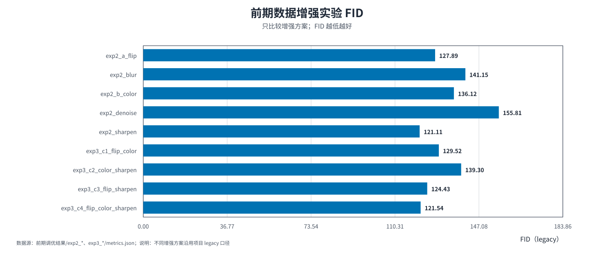
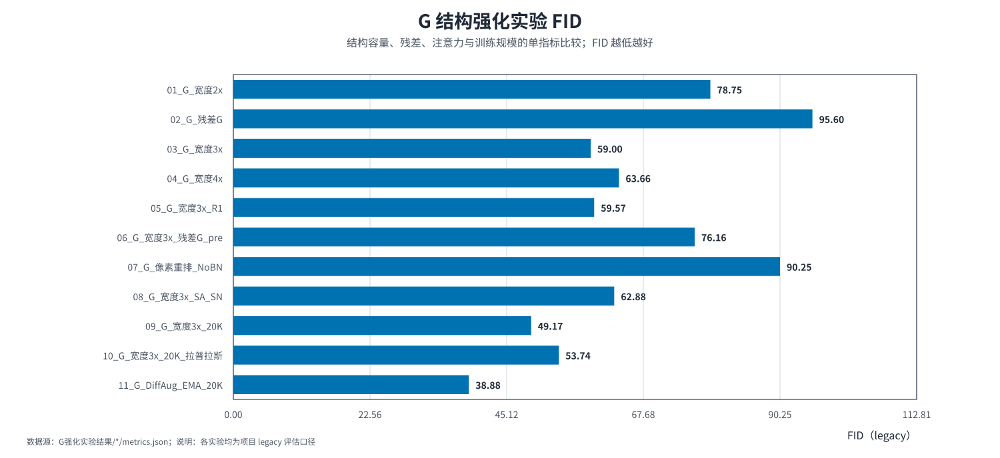
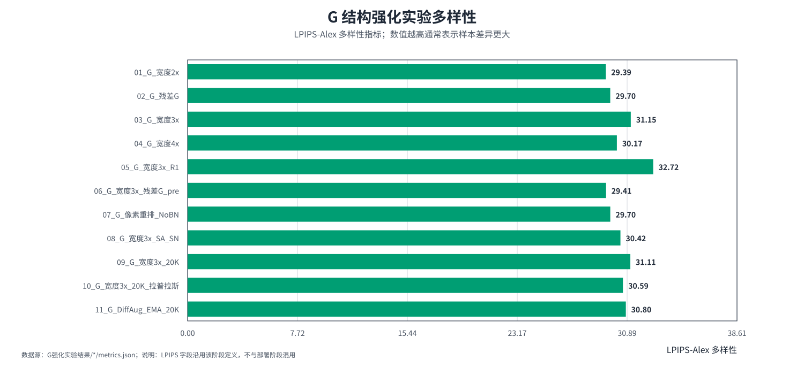
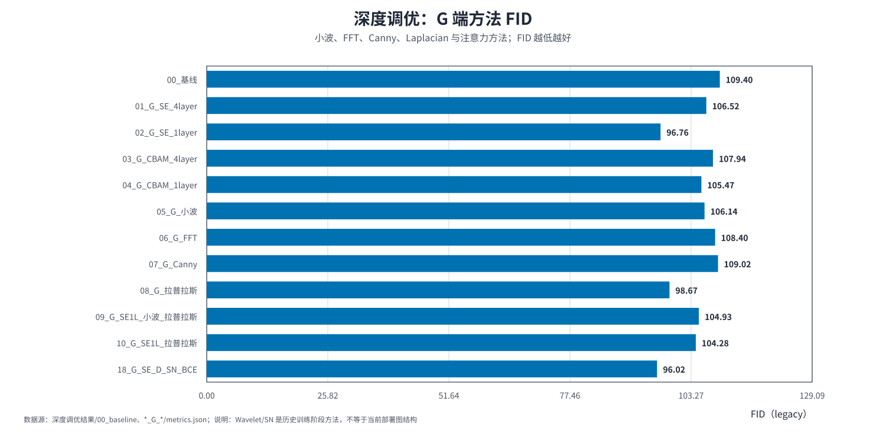
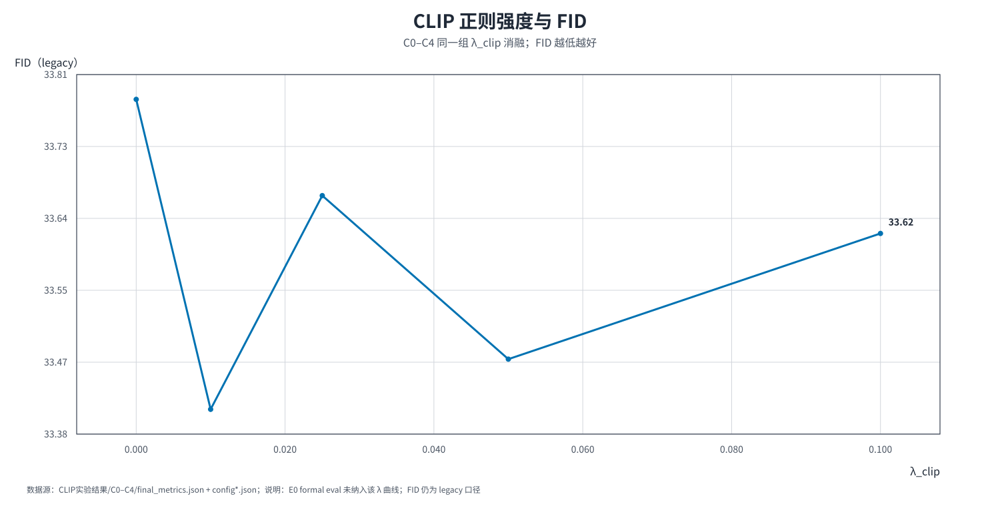
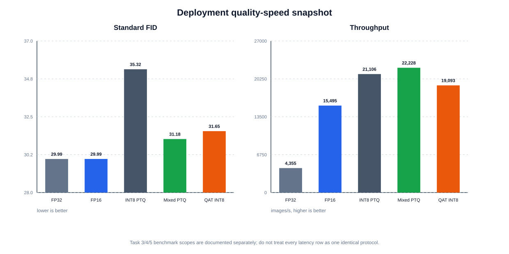
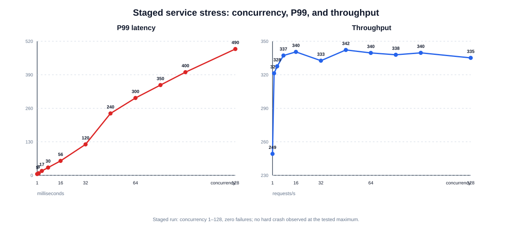

# DCGAN Anime-Face Lab


> A curated public snapshot of a one-month internship study on unconditional 64×64 anime-face generation, from DCGAN training ablations to cross-backend inference, quantization, and staged service stress testing.

This repository is an evidence-backed Kaggle archive and interview portfolio. It is not a one-command local reproduction package, a state-of-the-art claim, or a publication-ready statistical benchmark.

## What this project studies

The work is organized as a sequence of engineering and modeling questions:

1. How should training duration and image preprocessing be selected under a limited GPU budget?
2. Which generator/discriminator changes improve the adversarial game?
3. Do capacity, data scale, DiffAugment, and EMA matter more than isolated feature modules?
4. Does a frozen CLIP image encoder provide useful perceptual guidance beyond a no-CLIP continuation control?
5. Does replacing part of the original data with cleaned SDXL images improve long-tail coverage?
6. How much quality is lost when the Generator is exported, accelerated, quantized, and served?

## End-to-end experiment map

```mermaid
flowchart LR
    A[DCGAN baseline] --> B[Epoch and augmentation study]
    B --> C[G/D and feature-module ablations]
    C --> D[Generator scale, data scale, DiffAugment, EMA]
    D --> E[CLIP continuation and lambda sweep]
    E --> F[Clean-unique data audit]
    F --> G[Controlled SDXL replacement study]
    G --> H[ONNX export and numerical checks]
    H --> I[ORT / TensorRT / OpenVINO benchmark]
    I --> J[FP32 / FP16 / INT8 PTQ]
    J --> K[Layer sensitivity and mixed precision]
    K --> L[FakeQuantize QAT]
    L --> M[HTTP service and staged stress]
```



For a static export of the same workflow, see [`experiment-pipeline.svg`](docs/diagrams/experiment-pipeline.svg) and its editable [`experiment-pipeline.mmd`](docs/diagrams/experiment-pipeline.mmd).

## DCGAN core experiment record

The training line is documented separately from the later SDXL and deployment branches:

| Phase | Question | Representative evidence | Decision |
|---|---|---|---|
| 1. Budget and input policy | How much training and which basic augmentations? | 50 -> 300 epochs: Legacy FID 184.11 -> 105.34; sharpening was the best listed augmentation candidate at 121.11 | Select a practical epoch/input policy for later studies |
| 2. Module tuning | Do G-side features or D-side stabilization help? | No-added-module baseline 109.40; D SN + Hinge + R1 89.92 | D-side stabilization was the strongest Phase 2 path |
| 3. G strengthening | Do capacity, data scale, DiffAugment, and EMA help? | Width x3 + 20K + DiffAugment + EMA: Legacy FID 38.88 | Keep as a combined candidate, not a single-factor claim |
| 4. CLIP continuation | Does frozen CLIP guidance improve perceptual alignment? | C1 lowest FID 33.4114; C4 lowest CLIP MMD2 0.040990 | Treat FID and CLIP MMD2 as a trade-off |

The detailed record, source links, decision boundaries, and figure audit are in [`docs/dcgan_core_experiment_record.md`](docs/dcgan_core_experiment_record.md). The verified metric catalog is [`dcgan_core_metrics.csv`](03_metrics_and_logs/dcgan_core/dcgan_core_metrics.csv).

### Verified DCGAN figures from the current source directory













Only the seven DCGAN SVGs physically present in `dcgan_lab/results/figures` are embedded. The source manifest references nine additional DCGAN entries that are not embedded: seven loss figures were intentionally removed, and two non-loss figures are absent from the current source directory. The discrepancy is documented in [`figure_audit.csv`](03_metrics_and_logs/dcgan_core/figure_audit.csv).

The complete source-derived SVG gallery, including the physically present deployment, quantization, and service charts, is available in [`docs/source_figure_gallery.md`](docs/source_figure_gallery.md). The four soak-labeled source figures are shown there as provenance only and are not used to upgrade the latest staged service claim into a soak-test claim.

## Main findings

### 1. Training and modeling

| Scope | Representative result | Interpretation |
|---|---:|---|
| Epoch study | Legacy FID 184.11 → 105.34 from 50 → 300 epochs | Training budget matters, but is not the only factor. |
| Phase 2 baseline | 109.40 | No added deep module; retains the selected Phase 1 input policy. |
| D SN + Hinge | 96.25 | A discriminator-stabilization milestone. |
| D SN + Hinge + R1 | 89.92 | Best recorded Phase 2 candidate under its single-seed legacy protocol. |
| Width ×3 + 20K + DiffAugment + EMA | 38.88 | Strong later candidate; scope changes, so not a single-factor improvement claim. |
| CLIP λ=0.01 | 33.41 | Lowest Legacy FID in the local CLIP continuation sweep; C0 no-CLIP is required control. |

The headline historical metric is the project-specific Legacy FID. These rows should only be compared within their named scope.

### 2. SDXL controlled study: a useful negative result

| Group | Original | SDXL | Legacy FID | Coverage |
|---|---:|---:|---:|---:|
| A0 | 4,000 | 0 | 37.91 | 0.6687 |
| A10 | 3,600 | 400 | 37.99 | 0.6525 |
| A20 | 3,200 | 800 | 41.58 | 0.6108 |
| A30 | 2,800 | 1,200 | 44.92 | 0.5423 |
| A50 | 2,000 | 2,000 | 49.94 | 0.4397 |

Increasing the tested SDXL replacement ratio did not improve the controlled result. The likely engineering interpretation is distribution/style mismatch between the original and synthetic pools under the tested cleaning and fine-tuning protocol. This is a stopping result, not an omitted result.

### 3. Deployment and quantization

The current inference graph is a standard Generator graph:

```text
z [B,128,1,1]
  → ConvTranspose + BatchNorm + ReLU × 4
  → ConvTranspose + Tanh
  → image [B,3,64,64]
```

| Precision / strategy | Standard FID | Blur rate | Mean latency | Throughput |
|---|---:|---:|---:|---:|
| FP32 | 29.9911 | 12.0% | 14.6969 ms/batch | 4,354.7 images/s |
| FP16 | 29.9941 | 12.0% | 4.1304 ms/batch | 15,495.0 images/s |
| INT8 PTQ | 35.3198 | 12.5% | 3.0323 ms/batch | 21,106.1 images/s |
| Mixed `net.0 + net.12` FP16 | 31.1776 | 12.1% | 1.3349 ms/batch | 23,971.7 images/s |
| QAT INT8 | 31.6456 | 11.3% | 1.6760 ms/batch | 19,092.7 images/s |

The mixed-precision result is the selected quality-speed trade-off for the current graph. QAT improves over all-INT8 PTQ under the revised acceptance criterion, but does not beat the selected mixed-precision PTQ baseline on the archived comparison.

### 4. Staged service stress

The latest archived run used a single-process, single-worker TensorRT service on a Tesla T4 and tested HTTP concurrency 1, 2, 4, 8, 16, 32, 48, 64, 80, 96, and 128.

- 0 failed requests at every tested stage;
- P99 increased from 5 ms at concurrency 1 to 490 ms at concurrency 128;
- throughput stayed near 335–342 requests/s;
- 100 system-monitor samples were collected at a 5-second interval;
- peak GPU memory: 677.2 MB;
- peak service RSS: 1,077.8 MB;
- no hard crash was observed through the tested maximum.

This was a staged run, not a 30-minute soak. The repository therefore does not claim that long-running memory leaks have been ruled out.

## Visual evidence







### Qualitative samples

The gallery uses one compact representative image per stage. The Phase 2 baseline card is the plain no-added-module architectural control; it still uses the documented Phase 1 input policy.

<table>
  <tr>
    <td align="center"><b>Phase 1: epoch budget</b><br></td>
    <td align="center"><b>Phase 1: sharpening</b><br></td>
    <td align="center"><b>Phase 2: plain baseline</b><br></td>
  </tr>
  <tr>
    <td align="center"><b>Phase 2: D stabilization</b><br></td>
    <td align="center"><b>Phase 3: generator width</b><br></td>
    <td align="center"><b>Phase 3: DiffAugment + EMA</b><br></td>
  </tr>
  <tr>
    <td align="center"><b>Phase 5: CLIP continuation</b><br></td>
    <td align="center"><b>Phase 6: clean-unique data</b><br></td>
    <td align="center"><b>Phase 7: controlled SDXL</b><br></td>
  </tr>
</table>

The compact montage is also available as [`qualitative_samples_compact.png`](04_visual_assets/qualitative_samples_compact.png).

The SDXL pilot contact sheet is retained as a downloadable provenance artifact: [`sdxl_pilot_contact_sheet.jpg`](04_visual_assets/sdxl_pilot_contact_sheet.jpg).

## Metric comparability

No: the project does not use one universally interchangeable metric table.

- Historical training phases use the project’s Legacy Inception-v3 FID path.
- Deployment Task 3/4/5 also report a Standard Inception-v3 FID protocol.
- Phase 7 uses a fixed within-study Legacy FID and Coverage comparison with a 4K real pool and 5K fake features.
- CLIP-MMD, the AlexNet feature-distance proxy, diversity, blur rate, Laplacian variance, and edge density are supporting diagnostics, not replacements for a standardized FID benchmark.
- Most historical comparisons use one seed and one evaluation draw.
- Real images are primarily from the training distribution rather than a strict held-out test set.

See [`metric_protocol.md`](metric_protocol.md), [`docs/baseline_map.md`](docs/baseline_map.md), and [`docs/reproduction_boundary.md`](docs/reproduction_boundary.md).

The historical experiment index is [`results_summary.csv`](results_summary.csv); deployment-specific tables are under [`03_metrics_and_logs/deployment_optimization`](03_metrics_and_logs/deployment_optimization/).

The deployment evidence index is [`deployment_task_status.csv`](03_metrics_and_logs/deployment_optimization/deployment_task_status.csv), with quantitative details in [`deployment_quantization_summary.csv`](03_metrics_and_logs/deployment_optimization/deployment_quantization_summary.csv).

Additional process documents: [`docs/data_quality_and_sdxl_extension.md`](docs/data_quality_and_sdxl_extension.md), [`docs/experiment_process.md`](docs/experiment_process.md), [`docs/baseline_map.md`](docs/baseline_map.md), [`docs/interview_playbook.md`](docs/interview_playbook.md), [`docs/sdxl_controlled_study.md`](docs/sdxl_controlled_study.md), [`docs/month1_audit_2026-08.md`](docs/month1_audit_2026-08.md), and [`docs/next_phase_deployment_plan.md`](docs/next_phase_deployment_plan.md).

## Repository map

| Path | Purpose |
|---|---|
| `01_public_core/` | Public baseline, Exp11 recipe, and data-audit entry points |
| `02_selected_experiments/` | Selected training sources plus the deployment source archive |
| `03_metrics_and_logs/` | Curated metrics, logs, manifests, deployment tables, and stress evidence |
| `04_visual_assets/` | Interview figures, sample grids, and deployment charts |
| `docs/` | Protocols, audit findings, baseline relationships, and interview framing |
| `tests/` | Snapshot integrity checks |
| `tools/` | Deterministic figure builders |
| `03_metrics_and_logs/dcgan_core/` | DCGAN-only metric catalog and figure provenance audit |
| `docs/source_figure_gallery.md` | Gallery of all 33 physically present source SVGs |

## Reproduction boundary

This is a Kaggle experiment archive:

- datasets, FID image dumps, model weights, ONNX files, and TensorRT engines are not included;
- representative entry points expect Kaggle-mounted datasets and GPU/Internet settings;
- `requirements.txt` is a compatibility floor, not a lockfile;
- optional service utilities are listed in [`requirements-deployment.txt`](requirements-deployment.txt), while TensorRT remains platform-specific;
- the deployment summaries preserve runtime and engine metadata, but CPU RSS and whole-device CUDA snapshots are different memory measurements;
- the service stress archive documents one staged run and does not replace a long soak test.

Run the snapshot integrity checks with:

```bash
python -m unittest discover -s tests -v
```

## Claim boundary

This snapshot supports claims about applied experimentation, metric-aware decision-making, cross-backend benchmarking, quantization trade-offs, and staged service stress. It does not support claims of a novel GAN architecture, SOTA performance, successful whole-graph fusion acceleration, strict QAT high-frequency superiority, or completed long-run leak testing.

See [`docs/deployment_optimization.md`](docs/deployment_optimization.md), [`docs/month1_audit_2026-08.md`](docs/month1_audit_2026-08.md), [`docs/interview_playbook.md`](docs/interview_playbook.md), and [`CHANGELOG.md`](CHANGELOG.md).
