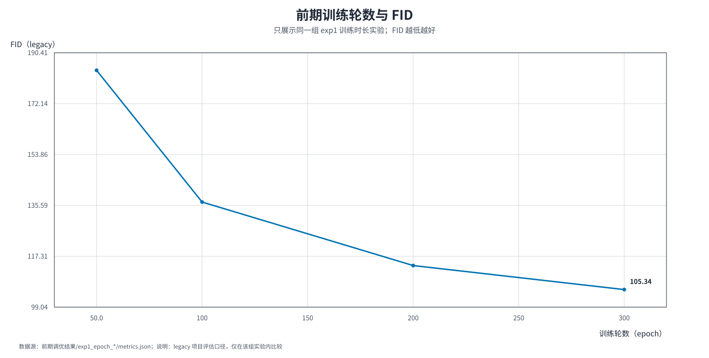
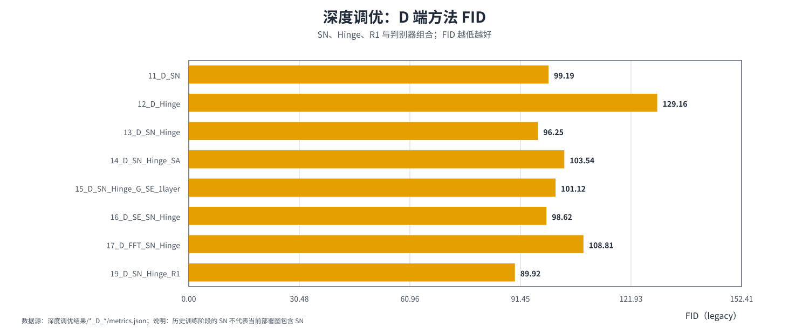

# DCGAN Anime-Face Lab


> A stage-based public snapshot of a one-month Kaggle internship study on unconditional 64 x 64 anime-face generation.

This repository records the experiment decisions in order: training budget, input augmentation, G/D tuning, generator strengthening, CLIP continuation, and finally deployment/quantization/service validation. It is an evidence-backed engineering archive, not a one-command local reproduction package or an SOTA claim.

## Project scope and protocol

- Dataset and training were run on Kaggle GPU notebooks.
- Historical DCGAN training phases report the project's **Legacy Inception-v3 FID**.
- Deployment phases report a separate **Standard Inception-v3 FID** and must not be placed on the same leaderboard.
- Most historical comparisons are single-seed and use a real-image distribution from the training pool rather than a strict held-out test set.
- Deleted representative loss figures are not recreated or presented as current evidence.

## Stage 1 — 前期训练与数据增强

### Question

How should the training budget and basic input policy be selected before deeper architectural changes?

### Evidence

| Experiment | Legacy FID | Interpretation |
|---|---:|---|
| 50 epochs | 184.11 | Early checkpoint |
| 100 epochs | 136.78 | Large early improvement |
| 200 epochs | 113.97 | Continued improvement |
| 300 epochs | 105.34 | Lower marginal gain |
| Sharpen augmentation | 121.11 | Lowest listed augmentation candidate |

The epoch study lowered FID by about 42.8% within the same recipe. Sharpening was the best recorded augmentation candidate in the listed small search; this does not establish a universal augmentation optimum.



More evidence: [stage 1 charts](04_visual_assets/stage_figures/01_前期训练与增强/) and [`phase1_early_tuning`](02_selected_experiments/full_process/phase1_early_tuning/).

## Stage 2 — G/D 模块与对抗目标调优

### Baseline definition

The Phase 2 `00_baseline` is the **no-added-deep-module architectural control**. It retains the selected Phase 1 input policy, so it should not be described as a model with no preprocessing at all. Its recorded Legacy FID is **109.40**.

### Evidence

| Path | Representative result | Interpretation |
|---|---:|---|
| G + SENet, 1 layer | 96.76 | Best listed G-side single-module candidate |
| G + Laplacian | 98.67 | Improvement in this run, not a universal module claim |
| D + SN + Hinge | 96.25 | Stabilization candidate |
| D + SN + Hinge + R1 | 89.92 | Best recorded Phase 2 candidate |

The strongest Phase 2 path came from discriminator-side stabilization. The full search was not a perfectly balanced factorial design, so individual module effects are conditional rather than fully isolated.



More evidence: [stage 2 charts](04_visual_assets/stage_figures/02_G_D模块调优/) and [`phase2_module_tuning`](02_selected_experiments/full_process/phase2_module_tuning/).

## Stage 3 — G 强化与训练策略

### Question

Do generator capacity, data scale, DiffAugment, and EMA matter more than isolated feature modules?

### Evidence

| Recipe | Legacy FID | Causal boundary |
|---|---:|---|
| G Width x2 | 78.75 | Capacity comparison |
| G Width x3 | 59.00 | Capacity comparison |
| G Width x4 | 63.66 | Capacity comparison |
| Width x3 + 20K data | 49.17 | Capacity and data-scale change |
| Width x3 + 20K + Laplacian | 53.74 | Combined change |
| Width x3 + 20K + DiffAugment + EMA | 38.88 | Strong combined candidate |

The 38.88 result is not attributed to one module. It is a later recipe that changes several factors together. The source archive also contains newer source-only scripts without a matching row in the current metric catalog; they are not presented as measured improvements.


More evidence: [stage 3 charts](04_visual_assets/stage_figures/03_G强化与训练策略/) and [`phase3_generator_strengthening`](02_selected_experiments/full_process/phase3_generator_strengthening/).

## Stage 4 — CLIP continuation 与权重消融

### Question

Does frozen CLIP image guidance improve perceptual alignment beyond a no-CLIP continuation control?

### Evidence

| Run | lambda | Legacy FID | CLIP MMD2 |
|---|---:|---:|---:|
| C0 continuation control | 0 | 33.7846 | 0.042832 |
| C1 | 0.0100 | 33.4114 | 0.042657 |
| C2 | 0.0250 | 33.6687 | 0.042298 |
| C3 | 0.0500 | 33.4718 | 0.041856 |
| C4 | 0.1000 | 33.6231 | 0.040990 |

C1 has the lowest FID, while C4 has the lowest CLIP MMD2. The correct conclusion is a perceptual trade-off, not “larger CLIP weight is always better.”


More evidence: [stage 4 charts](04_visual_assets/stage_figures/04_CLIP调优/) and [`phase5_clip_tuning`](02_selected_experiments/full_process/phase5_clip_tuning/).

## Stage 5 — 部署、量化与推理效率

This stage is evaluated separately from the historical training leaderboard.

| Precision / strategy | Standard FID | Blur rate | Throughput |
|---|---:|---:|---:|
| FP32 | 29.9911 | 12.0% | 4,354.7 images/s |
| FP16 | 29.9941 | 12.0% | 15,495.0 images/s |
| INT8 PTQ | 35.3198 | 12.5% | 21,106.1 images/s |
| Mixed `net.0 + net.12` FP16 | 31.1776 | 12.1% | 23,971.7 images/s |
| QAT INT8 | 31.6456 | 11.3% | 19,092.7 images/s |

The mixed-precision path is the selected quality-speed trade-off for the current graph. QAT improves over all-INT8 PTQ under the revised acceptance criterion, but does not beat the selected mixed PTQ result.


More evidence: [stage 5 charts](04_visual_assets/stage_figures/05_部署与量化/), [`deployment_optimization.md`](docs/deployment_optimization.md), [`deployment_task_status.csv`](03_metrics_and_logs/deployment_optimization/deployment_task_status.csv), and [`deployment_quantization_summary.csv`](03_metrics_and_logs/deployment_optimization/deployment_quantization_summary.csv).

## Stage 6 — 服务阶梯压测

The current archived staged run tests concurrency 1, 2, 4, 8, 16, 32, 48, 64, 80, 96, and 128 on a single-process TensorRT service.

- 0 failed requests at every tested stage;
- P99 latency increased from 5 ms to 490 ms;
- throughput stayed near 335–342 requests/s;
- peak GPU memory was 677.2 MB and peak RSS was 1,077.8 MB;
- 128 is the maximum tested concurrency, not a proven physical crash point;
- no long soak conclusion is claimed because the current raw result package contains no corresponding completed soak table.


More evidence: [stage 6 charts](04_visual_assets/stage_figures/06_服务压测/) and [`service_stress_summary.csv`](03_metrics_and_logs/deployment_optimization/06_Service_Stress/service_stress_summary.csv).

## Objective audit and freeze boundary

- Cross-stage FID values are not a universal ranking because the historical and deployment protocols differ.
- Loss magnitudes are not comparable across BCE, Hinge, R1, CLIP, and auxiliary-loss objectives.
- LPIPS, Laplacian variance, edge density, blur rate, and CLIP MMD2 are supporting diagnostics, not replacements for a standardized held-out FID benchmark.
- The 38.88 generator result is a multi-factor candidate, not a single-module ablation.
- The source figure directory contained 33 SVGs while its manifest referenced more; deleted loss figures are recorded as intentionally excluded rather than silently recreated.
- The complete stage map is [`stage_figures_map.csv`](03_metrics_and_logs/stage_figures_map.csv), and the detailed DCGAN audit is [`dcgan_core_experiment_record.md`](docs/dcgan_core_experiment_record.md).

## Repository map

| Path | Purpose |
|---|---|
| `01_public_core/` | Public baseline and selected entry points |
| `02_selected_experiments/` | Curated training and deployment source archive |
| `03_metrics_and_logs/` | Metrics, manifests, audit tables, and raw-evidence extracts |
| `04_visual_assets/stage_figures/` | Re-generated Chinese single-metric charts organized by stage |
| `04_visual_assets/source_figures/` | Source-folder chart archive and provenance-only figures |
| `docs/` | Protocols, stage record, audit, and interview framing |
| `tests/` | Snapshot integrity checks |
| `tools/build_stage_figures.js` | Result-driven chart rebuild script |

## Reproduction boundary

The original work depends on Kaggle-mounted datasets, checkpoints, GPU libraries, and evaluation assets. This public freeze preserves the scripts, result tables, charts, provenance, and claim boundaries; it does not claim one-command local reproduction.

Run the snapshot checks with:

```bash
python -m unittest discover -s tests -v
```

## Historical records

See [`metric_protocol.md`](metric_protocol.md), [`baseline_map.md`](docs/baseline_map.md), [`experiment_process.md`](docs/experiment_process.md), [`interview_playbook.md`](docs/interview_playbook.md), [`month1_audit_2026-08.md`](docs/month1_audit_2026-08.md), [`next_phase_deployment_plan.md`](docs/next_phase_deployment_plan.md), and [`CHANGELOG.md`](CHANGELOG.md).
