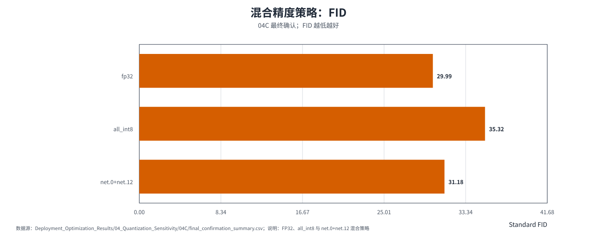
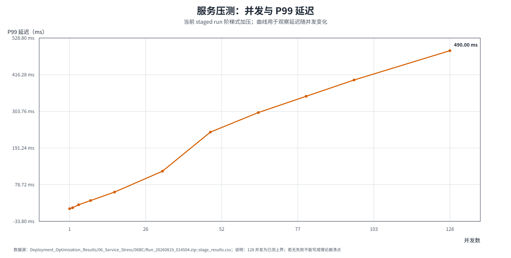
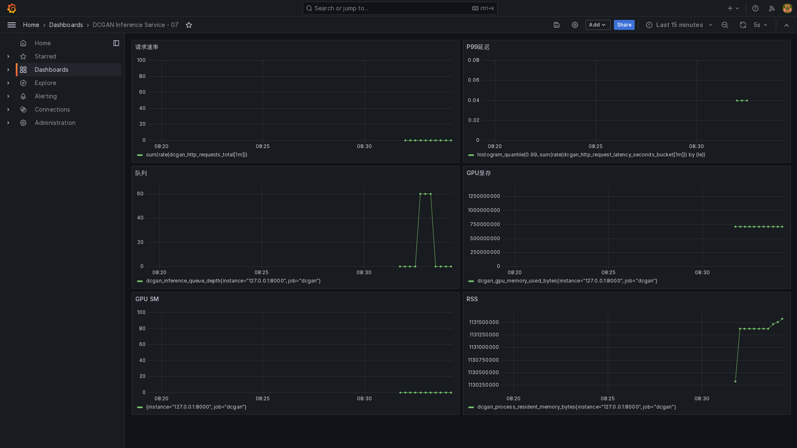
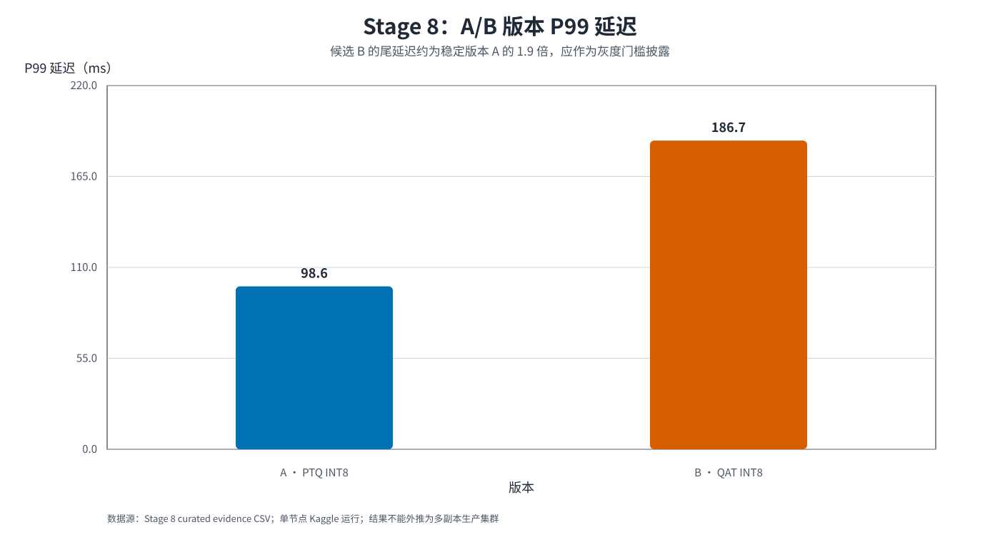
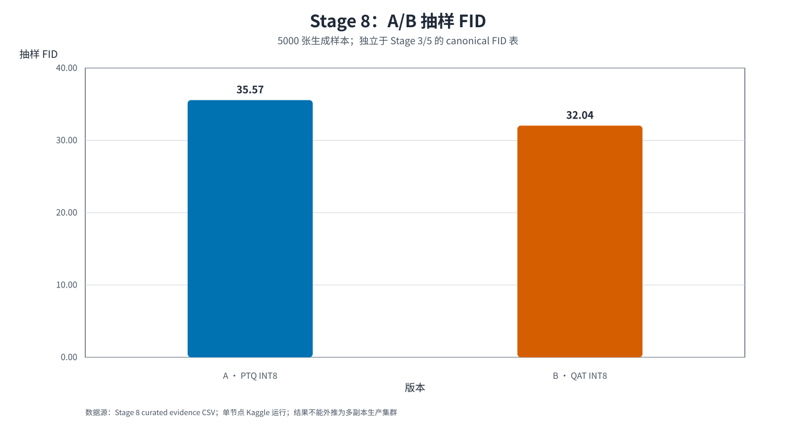
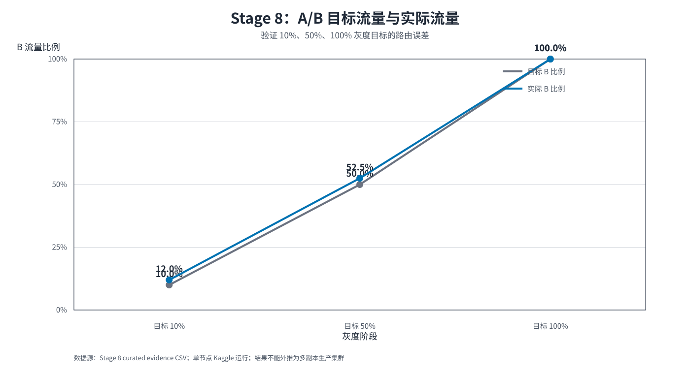

# DCGAN Anime-Face Lab

> A stage-based AI/ML research and engineering showcase for unconditional 64 × 64 anime-face generation under Kaggle GPU constraints.

This repository is a curated public snapshot of a one-month internship study. It preserves the experiment questions, controls, metrics, sample grids, deployment evidence, and reproducibility boundaries. It is an evidence-backed research archive and engineering case study, not a one-command local training package or an SOTA claim.

For a claim-by-claim review, start with the [experiment coverage audit](docs/experiment_coverage_audit_2026-09-03.md), which separates measured runs, source-only scripts, partial deployment probes, and non-comparable metric protocols.

For the complete internship archive and engineering narrative, see the [Project Engineering Report](docs/PROJECT_ENGINEERING_REPORT_2026-09-03.md) and the [scanned project inventory](03_metrics_and_logs/project_inventory_2026-09-03.json).

## 30-second overview

### Problem

How far can a conventional PyTorch DCGAN be improved under a constrained single-GPU workflow, and which changes remain useful when the generator moves from training experiments to an inference service?

### What was built

- A plain DCGAN architectural control with a documented input policy.
- A staged ablation path covering training budget, preprocessing, G/D stabilization, generator capacity, data scale, DiffAugment, EMA, and CLIP feature-distribution matching.
- A SHA-256 data-quality audit and a controlled SDXL replacement side study.
- An ONNX/TensorRT/precision-comparison workflow with quality-speed trade-off analysis.
- A staged HTTP stress test, 60-minute soak, and dynamic-batching comparison with P99, throughput, error rate, GPU memory, SM utilization, and process RSS evidence.
- A monitoring and rollout track: Prometheus/Alertmanager/Grafana observability, controlled alert firing/resolution, zero-downtime hot loading, deterministic A/B routing, and rollback evidence.

### Headline evidence

| Scope | Best recorded value | What it means |
|---|---:|---|
| Historical Legacy FID | 109.40 → 38.88 | Improvement from the Phase 2 no-added-module control to a later multi-factor candidate |
| CLIP continuation | C1: 33.4114 Legacy FID | Lowest FID in the matched C0–C4 continuation sweep |
| CLIP distribution metric | C4: 0.040990 CLIP MMD² | Lowest MMD² in the same sweep; not the lowest FID |
| Deployment Standard FID | FP32 29.9911; FP16 29.9941 | FP16 was near-lossless under the deployment protocol |
| Selected mixed precision | 31.1776 Standard FID; 23,971.7 images/s | Quality-speed candidate retaining selected sensitive layers in FP16 |
| Fixed-batch service | 0 failures through concurrency 512; P99 5 → 1,600 ms | A measured capacity range, not a proven physical crash threshold; soft latency knee around 32 |
| 60-minute soak | 1,226,890 requests; 0 failures; P99 63 ms | Steady-state leak screening at concurrency 16; RSS head-tail +3.32%, GPU-memory head-tail 0% |
| Dynamic batching | Max observed batch 8; +14.01% RPS at concurrency 32 | 5 ms queue window improves throughput at medium/high concurrency; low concurrency pays queueing overhead |
| Observability | Health/generate/metrics 200; 2 rules loaded; firing/resolved observed | Monitoring path passed in a Kaggle single-node run; queue alert is a controlled simulation |
| Hot update + A/B | PID unchanged; B FID 32.0422 vs A 35.5710; 100% success | Single-node zero-downtime load, traffic split and rollback validated; B P99 186.7 ms vs A 98.6 ms |

The historical Legacy FID values, deployment Standard FID values, and CLIP MMD² values are different protocols and must not be sorted as one universal leaderboard.

## Visual summary

### Experiment roadmap

### Baseline → selected candidate

The two images below are separate sample grids from fixed milestone artifacts. They are intentionally not replaced by a single long composite image.

#### Phase 2 no-added-module control

#### Phase 3 DiffAugment + EMA candidate

## Technical route

~~~mermaid
flowchart TB
    subgraph DATA["Data and evaluation boundary"]
        direction LR
        A["Kaggle image pool same core dataset"] --> B["Data audit validate · deduplicate · document"]
        B --> P["Protocol ledger Legacy FID · LPIPS · CLIP MMD²"]
    end

    subgraph CORE["Core research track · fixed data scope"]
        direction LR
        C["Stage 1 Training budget + preprocessing"] --> D["Stage 2 Plain DCGAN control + module ablation"]
        D --> E["Stage 3 G capacity + DiffAugment + EMA"]
        E --> F["Stage 4 CLIP continuation + trade-off analysis"]
        F --> G["Selection boundary quality · diversity protocol caveats"]
    end

    subgraph SIDE["Side study · independent data-scope branch"]
        direction LR
        H["SDXL candidate pool"] --> I["Style filter + unique-content audit"]
        I --> J["Mixing-ratio ablation A0 · A10 · A20 · A30 · A50"]
    end

    subgraph DEPLOY["Engineering track · selected checkpoint"]
        direction LR
        K["Stage 5 ONNX export + engine/precision matrix"] --> L["Stage 6 service stress + resource boundary"]
        L --> M["Stage 7 observability + alert path"]
        M --> N["Stage 8 hot update + A/B + rollback"]
    end

    P --> C
    P --> H
    G --> K
    J -. "separate data scope not an architecture regression" .-> G

    classDef boundary fill:#e8f1fb,stroke:#2563eb,color:#0f172a,stroke-width:1.5px;
    classDef stage fill:#f8fafc,stroke:#64748b,color:#0f172a,stroke-width:1.2px;
    classDef decision fill:#ecfdf5,stroke:#059669,color:#064e3b,stroke-width:1.5px;
    classDef side fill:#fffbeb,stroke:#d97706,color:#78350f,stroke-width:1.2px;
    classDef deploy fill:#f5f3ff,stroke:#7c3aed,color:#4c1d95,stroke-width:1.2px;
    class A,B,P boundary;
    class C,D,E,F stage;
    class G decision;
    class H,I,J side;
    class K,L,M,N deploy;
~~~

Solid arrows represent the main measured path. Dashed arrows mark a separate data scope or an interpretation boundary; they are intentionally not presented as direct architecture comparisons.

## Dataset and preprocessing

### Dataset boundary

Training and evaluation were performed in Kaggle notebooks using a permitted anime-face image dataset. The images themselves and large model binaries are not committed to this public repository.

The later audit found:

| Audit item | Recorded value |
|---|---:|
| Image paths scanned | 21,551 |
| Unique SHA-256 contents | 17,029 |
| Exact-duplicate groups | 3,626 |
| Redundant copies | 4,522 |
| Invalid files | 0 |

The clean-unique B1 baseline reports Legacy FID 45.07, but it uses a different data pool from the historical 38.88 Exp11 candidate. It is therefore a data-quality control, not a direct architecture regression.

Evidence: [data-quality audit](docs/data_quality_and_sdxl_extension.md), [unique-content manifest](03_metrics_and_logs/phase6_data_audit/).

### Input and training-time transformations

| Location | Transformation | Purpose |
|---|---|---|
| All core runs | Resize to 64 × 64, RGB conversion, tensor normalization to approximately [-1, 1] | Match the DCGAN input/output range |
| Phase 1 and selected baseline | Random horizontal flip, p = 0.5 | Low-cost pose variation |
| Phase 1 and selected baseline | EdgeSharpen, p = 0.2, alpha = 0.3 | Test whether local contours help |
| Exp11 / selected candidate | DiffAugment: color, translation, cutout | Reduce discriminator memorization at the real/fake boundary |
| Exp11 / selected candidate | Symmetric differentiable augmentation on real and fake paths | Keep the generator gradient path valid |
| Exp11 / selected candidate | Generator EMA, decay = 0.9999 | Use a smoothed generator for evaluation and sampling |

The early preprocessing search tested flip, color, blur, denoise, sharpening, and combinations. Sharpening was the best recorded candidate in that small search; this is not a universal augmentation claim.

## Baseline DCGAN architecture

The Phase 2 baseline is the architectural control used for the module study. It has no newly added attention, frequency, edge, spectral-normalization, Hinge, or R1 module. It does retain the selected Phase 1 input policy, so “plain baseline” does not mean “no preprocessing.”

~~~mermaid
flowchart LR
    subgraph GEN["Generator G · Phase 2 plain control"]
        direction TB
        Z["Noise z B × 100 × 1 × 1"] --> G0["4 × 4 100 → 256 ConvTranspose + BN + ReLU"]
        G0 --> G1["8 × 8 256 → 128 ConvTranspose + BN + ReLU"]
        G1 --> G2["16 × 16 128 → 64 ConvTranspose + BN + ReLU"]
        G2 --> G3["32 × 32 64 → 32 ConvTranspose + BN + ReLU"]
        G3 --> G4["64 × 64 × 3 32 → 3 · Tanh"]
    end

    subgraph DISC["Discriminator D · Phase 2 plain control"]
        direction TB
        XR["Real image x B × 3 × 64 × 64"] --> D0["32 × 32 3 → 32 · Conv + LeakyReLU"]
        XF["Generated image from G(z)"] --> D0
        D0 --> D1["16 × 16 32 → 64 · Conv + LeakyReLU"]
        D1 --> D2["8 × 8 64 → 128 · Conv + LeakyReLU"]
        D2 --> D3["4 × 4 128 → 256 · Conv + LeakyReLU"]
        D3 --> D4["Flatten 4096 → 256 · LeakyReLU"]
        D4 --> D5["Real/fake score 256 → 1 · Sigmoid"]
    end

    G4 -->|fake image| XF
    D5 --> LOSS["BCE objective alternating G/D updates Adam: 1e-4 · β=(0.5, 0.99)"]

    classDef io fill:#e8f1fb,stroke:#2563eb,color:#0f172a,stroke-width:1.2px;
    classDef layer fill:#f8fafc,stroke:#64748b,color:#0f172a,stroke-width:1.1px;
    classDef output fill:#ecfdf5,stroke:#059669,color:#064e3b,stroke-width:1.3px;
    classDef objective fill:#f5f3ff,stroke:#7c3aed,color:#4c1d95,stroke-width:1.3px;
    class Z,XR io;
    class G0,G1,G2,G3,D0,D1,D2,D3,D4 layer;
    class G4,D5,XF output;
    class LOSS objective;
~~~

### Baseline training configuration

| Item | Phase 2 control |
|---|---|
| Resolution | 64 × 64 RGB |
| Latent dimension | 100 |
| Batch size | 32 |
| Optimizer | Adam, learning rate 1e-4, betas (0.5, 0.99) |
| Objective | BCE generator/discriminator objective |
| Training budget | 200 epochs for the deep-tuning control |
| Seed | 42 in the recorded script |
| Evaluation | Historical torchvision Inception-v3 FID pipeline |

Source implementation: [00_baseline.py](02_selected_experiments/full_process/phase2_module_tuning/00_baseline.py). The original compact model definition is [original_model64.py](01_public_core/original_model64.py).

## Stage 1 — Training budget and preprocessing

### Goal

Choose a practical training budget and input policy before changing the architecture.

### Modification and control

The epoch study varied 50, 100, 200, and 300 epochs under one recipe. The augmentation study then compared individual and combined preprocessing candidates.

### Results

| Experiment | Legacy FID | Reading |
|---|---:|---|
| 50 epochs | 184.11 | Early checkpoint |
| 100 epochs | 136.78 | Large early improvement |
| 200 epochs | 113.97 | Continued improvement |
| 300 epochs | 105.34 | Lower marginal gain than earlier intervals |
| Sharpen | 121.11 | Best listed single candidate |
| Flip + Sharpen | 124.43 | Competitive combination |
| Flip + Color + Sharpen | 121.54 | Close to Sharpen in this run |

### Conclusion

Within this recipe, longer training improved the recorded Legacy FID. The selected practical budget was a comparison choice under Kaggle compute limits, not a proof that 200 or 300 epochs is globally optimal.

### Failure experiments and interpretation

Blur and denoise were weaker in the listed search, with Legacy FID 141.15 and 155.81. Color alone was also weaker at 136.12. These results suggest that adding a transformation is not automatically beneficial; the conclusion is limited to the tested recipe and seed.

Evidence: [Stage 1 FID chart](04_visual_assets/stage_figures/01_前期训练与增强/01_训练轮数_FID.svg), [all Stage 1 charts](04_visual_assets/stage_figures/01_前期训练与增强/), [full process sources](02_selected_experiments/full_process/phase1_early_tuning/), [metric catalog](03_metrics_and_logs/dcgan_core/dcgan_core_metrics.csv).

## Stage 2 — G/D modules and adversarial objectives

### Goal

Test whether edge, frequency, attention, spectral normalization, Hinge loss, and R1 regularization improve the plain control.

### Modification and control

The explicit control is Phase 2 00_baseline at Legacy FID 109.40. The G-side and D-side searches are reported separately because they were not a perfectly balanced factorial design.

### Results

| Comparison scope | Variant | Legacy FID | Interpretation |
|---|---|---:|---|
| G-side | G + SENet, one layer | 96.76 | Best listed G-side single-module candidate |
| G-side | G + Laplacian | 98.67 | Improvement in this run |
| G-side | G + Wavelet | 106.14 | Close to control |
| G-side | G + FFT | 108.40 | Little change in this run |
| G-side | G + Canny | 109.02 | Little change in this run |
| D-side | D + SN | 99.19 | Stabilization candidate |
| D-side | D + Hinge | 129.16 | Worse than control in this run |
| D-side | D + SN + Hinge | 96.25 | Stronger combined candidate |
| D-side | D + SN + Hinge + R1 | 89.92 | Best recorded Phase 2 candidate |

### Conclusion

Discriminator-side stabilization was more promising than adding every proposed feature module. The result is a conditional engineering observation, not an isolated causal effect for every component.

### Failure experiments and interpretation

Wavelet, FFT, and Canny did not outperform the control by a meaningful margin in this scope. Hinge without SN was also weaker. This is why the later showcase recipe uses the simpler SN + Hinge discriminator path rather than presenting every proposed feature block as necessary.

Evidence: [D-module FID chart](04_visual_assets/stage_figures/02_G_D模块调优/06_D端模块_FID.svg), [all G/D charts](04_visual_assets/stage_figures/02_G_D模块调优/), [module-tuning sources](02_selected_experiments/full_process/phase2_module_tuning/), [DCGAN experiment record](docs/dcgan_core_experiment_record.md).

## Stage 3 — Generator capacity, data scale, DiffAugment, and EMA

### Goal

Determine whether capacity, data scale, and training-trajectory stabilization matter more than isolated feature modules.

### Modification and control

The Width ×3 path was held as the main capacity candidate. Data scale was then increased from 10K to 20K, followed by a combined DiffAugment + EMA intervention.

### Results

| Recipe | Legacy FID | What changed |
|---|---:|---|
| G Width ×2 | 78.75 | Capacity |
| G Width ×3 | 59.00 | Capacity |
| G Width ×4 | 63.66 | Capacity |
| Width ×3 + 20K data | 49.17 | Capacity and data scale |
| Width ×3 + 20K + Laplacian | 53.74 | Adds Laplacian term |
| Width ×3 + 20K + DiffAugment + EMA | 38.88 | Multi-factor candidate |

### Conclusion

The strongest recorded historical candidate is the combined 38.88 recipe. It is not valid to attribute 38.88 to DiffAugment, EMA, or Width ×3 alone because the final comparison changes multiple factors relative to the original control.

The cleanest within-stage comparison is the Width ×3 to Width ×3 + 20K transition. The later DiffAugment + EMA result is best described as a practical combined intervention.

### Failure experiments and interpretation

Width ×4 was worse than Width ×3 in the tested budget. Adding Laplacian to the Width ×3 + 20K path regressed from 49.17 to 53.74. A Width ×3 + R1 run also regressed from 59.00 to 59.57. These negative results constrained the final recipe.

Evidence: [G FID chart](04_visual_assets/stage_figures/03_G强化与训练策略/03_G结构强化_FID.svg), [FID and diversity charts](04_visual_assets/stage_figures/03_G强化与训练策略/), [selected candidate source](02_selected_experiments/full_process/phase3_generator_strengthening/11_G_DiffAug_EMA_20K.py), [full experiment record](docs/dcgan_core_experiment_record.md).

## Stage 4 — CLIP continuation and weight ablation

### Goal

Measure whether a frozen CLIP image encoder and distribution-level MMD objective improve perceptual alignment after the Exp11 checkpoint.

### Modification and control

C0 continues the same checkpoint without CLIP loss. C1–C4 add the frozen CLIP image-feature MMD objective at different weights. This control separates the effect of CLIP from the effect of simply training for longer.

### Results

| Run | CLIP lambda | Legacy FID | CLIP MMD² | Reading |
|---|---:|---:|---:|---|
| C0 continuation control | 0 | 33.7846 | 0.042832 | No-CLIP control |
| C1 | 0.0100 | 33.4114 | 0.042657 | Lowest FID in this sweep |
| C2 | 0.0250 | 33.6687 | 0.042298 | Lower MMD², not lower FID |
| C3 | 0.0500 | 33.4718 | 0.041856 | Near-best FID |
| C4 | 0.1000 | 33.6231 | 0.040990 | Lowest MMD² in this sweep |

### Conclusion

C1 is the FID winner while C4 is the CLIP-MMD winner. The defensible conclusion is a metric-dependent trade-off, not “larger CLIP weight is better.” CLIP is an optional continuation branch and is not part of the recorded 38.88 Exp11 recipe.

### Failure experiments and interpretation

The C0 control shows why a no-CLIP continuation is required. A lower CLIP MMD² does not guarantee a lower Legacy FID, and the sweep does not support selecting a universal CLIP weight.

Evidence: [CLIP FID chart](04_visual_assets/stage_figures/04_CLIP调优/07_CLIP_FID.svg), [CLIP FID and MMD² charts](04_visual_assets/stage_figures/04_CLIP调优/), [CLIP source](02_selected_experiments/full_process/phase5_clip_tuning/), [CLIP control record](docs/dcgan_core_experiment_record.md).

## Stage 5 — Export, engines, precision, and quality-speed trade-offs

### Goal

Move the current Generator toward inference use and measure the quality cost of FP16, INT8 PTQ, mixed precision, and QAT.

### System path

~~~mermaid
flowchart TB
    subgraph BUILD["1 · Build and validate the graph"]
        direction LR
        Z["Latent z B × 128 × 1 × 1"] --> G["Generator checkpoint"]
        G --> O["ONNX export"]
        O --> V{"Validation gate onnx.checker + shape/parity checks"}
    end

    subgraph ENGINES["2 · Runtime matrix"]
        direction LR
        V --> ORT["ONNX Runtime CPU / GPU"]
        V --> TRT["TensorRT GPU"]
        V --> OV["OpenVINO CPU"]
    end

    subgraph PRECISION["3 · Precision variants"]
        direction LR
        V --> FP32["FP32 reference"]
        V --> FP16["FP16 near-lossless check"]
        V --> PTQ["INT8 PTQ calibration baseline"]
        V --> MIX["Mixed PTQ net.0 + net.12 in FP16"]
        V --> QAT["QAT INT8 fake-quant fine-tuning"]
    end

    subgraph EVIDENCE["4 · Evidence and acceptance"]
        direction LR
        Q["Quality FID · blur rate · LPIPS"]
        S["Systems latency · throughput · VRAM"]
        T["Service batch · concurrency · P99"]
        R["Decision record quality–speed trade-off"]
    end

    ORT --> S
    TRT --> S
    OV --> S
    FP32 --> Q
    FP16 --> Q
    PTQ --> Q
    MIX --> Q
    Q --> R
    S --> R
    R --> T

    W["Compatibility probes Haar wavelet · dynamic SN"] -. "investigation only not in deployed graph" .-> V

    classDef input fill:#e8f1fb,stroke:#2563eb,color:#0f172a,stroke-width:1.2px;
    classDef build fill:#f8fafc,stroke:#64748b,color:#0f172a,stroke-width:1.1px;
    classDef gate fill:#fff7ed,stroke:#ea580c,color:#7c2d12,stroke-width:1.5px;
    classDef engine fill:#eef2ff,stroke:#4f46e5,color:#1e1b4b,stroke-width:1.1px;
    classDef precision fill:#ecfdf5,stroke:#059669,color:#064e3b,stroke-width:1.1px;
    classDef evidence fill:#f5f3ff,stroke:#7c3aed,color:#4c1d95,stroke-width:1.2px;
    classDef caveat fill:#fef2f2,stroke:#dc2626,color:#7f1d1d,stroke-width:1.1px;
    class Z input;
    class G,O build;
    class V gate;
    class ORT,TRT,OV engine;
    class FP32,FP16,PTQ,MIX,QAT precision;
    class Q,S,T,R evidence;
    class W caveat;
~~~

The actual deployed graph is a standard ConvTranspose + BatchNorm + ReLU + Tanh graph. The independent Haar-wavelet and dynamic-SN probes are compatibility investigations, not nodes in the current deployed graph.

### Quality-speed table

| Precision / strategy | Standard FID | Blur rate | Throughput | Role |
|---|---:|---:|---:|---|
| FP32 | 29.9911 | 12.0% | 4,354.7 images/s | Reference |
| FP16 | 29.9941 | 12.0% | 15,495.0 images/s | Near-lossless precision |
| INT8 PTQ | 35.3198 | 12.5% | 21,106.1 images/s | Faster with quality loss |
| Mixed PTQ, net.0 + net.12 in FP16 | 31.1776 | 12.1% | 23,971.7 images/s | Selected quality-speed candidate |
| QAT INT8 | 31.6456 | 11.3% | 19,092.7 images/s | Revised acceptance pass |

The throughput figures come from their recorded benchmark scopes and should not be treated as a single perfectly matched leaderboard. The robust conclusion is that full INT8 reduced quality, while selective FP16 retention recovered much of the quality at high throughput. QAT improved over all-INT8 PTQ under the revised acceptance, but did not beat the selected mixed-precision result.

### Failure experiments and interpretation

The original custom-operator deployment idea was not represented as a production graph. The current graph has no deployed wavelet or dynamic-SN operator. The QAT evidence also does not prove a strict high-frequency hair/eyeliner advantage over mixed PTQ because the public acceptance metrics are global diagnostics.

Evidence: [deployment optimization report](docs/deployment_optimization.md), [task status](03_metrics_and_logs/deployment_optimization/deployment_task_status.csv), [quality-speed summary](03_metrics_and_logs/deployment_optimization/deployment_quantization_summary.csv), [Stage 5 charts](04_visual_assets/stage_figures/05_部署与量化/).

## Stage 6 — Service stress and operational boundary

### Goal

Validate the service path under staged concurrency and observe latency, throughput, failures, and memory behavior.

### Modification and control

The archived runs use a single-process, single-worker TensorRT service on a Kaggle Tesla T4. The fixed-batch control uses engine batch 1 and HTTP request concurrency. A separate dynamic-batching study uses a 5 ms queue window and a maximum service batch of 8; it is reported as a serving-policy comparison, not as a new training experiment.

### Results

| Observation | Recorded value |
|---|---:|
| Fixed-batch tested concurrency | 1–512 |
| Fixed-batch failed requests | 0 at every tested stage |
| Fixed-batch P99 latency | 5 ms → 1,600 ms |
| Fixed-batch soft latency knee | Around concurrency 32 |
| Fixed-batch peak GPU memory / SM | 677.2 MB / 19% |
| Fixed-batch service RSS | Approximately 1,070.9 → 1,114.8 MB |
| 60-minute steady soak | 3,601.6 s; 1,226,890 requests; 0 failures; P99 63 ms; 340.83 RPS |
| Dynamic batching | Batch 2/4/8 observed; 0 failures through concurrency 128; soft knee around 64 |
| Dynamic batching at concurrency 32 | P99 90 vs 110 ms; 401.73 vs 352.35 RPS; +14.01% RPS |

### Conclusion and boundary

The fixed-batch run demonstrates stable HTTP behavior through concurrency 512, but no hard crash or OOM was observed; the physical crash boundary is therefore only known to be above the tested range. The 60-minute steady soak passed its declared request/failure and head-tail resource checks, which is useful leak-screening evidence but not a mathematical proof of no memory leak. Dynamic batching improved throughput at medium/high concurrency, with the expected queue-window trade-off at low concurrency.

Dynamic-batching figures and raw summaries are kept under [06F dynamic batching evidence](03_metrics_and_logs/deployment_optimization/06_Service_Stress/06F/). The downloaded dynamic-batching archive has packaging gaps (runtime summary/log files are not all present), so the public claim is based on the available source report, manifest, summary tables, and figures; this is marked as `complete_with_packaging_gaps`.

Evidence: [06E fixed-batch and soak audit](03_metrics_and_logs/deployment_optimization/06_Service_Stress/06E/), [06F dynamic-batching evidence](03_metrics_and_logs/deployment_optimization/06_Service_Stress/06F/), [normalized operational table](03_metrics_and_logs/deployment_optimization/service_operational_summary_v08.csv), [Stage 6 charts](04_visual_assets/stage_figures/06_服务压测/), [deployment report](docs/deployment_optimization.md).

## Stage 7 — Observability and alert validation

### Goal

Add the operational feedback loop around the inference service: health endpoints, Prometheus scraping, Grafana dashboards, Alertmanager routing, resource sampling, and alert recovery.

### Modification and control

The Kaggle notebook starts the service-side monitoring stack and records the same `/health`, `/generate`, and `/metrics` checks used by the serving stages. Two rules were loaded: queue backlog and high P99 latency. Queue depth was deliberately raised to a controlled value to verify the firing and resolved path; it is not evidence of a real production incident.

### Results

| Check | Recorded evidence |
|---|---:|
| Health / generate / metrics | HTTP 200 / 200 / 200 |
| Rules loaded | 2 |
| Prometheus target | Up |
| Alert lifecycle | Firing and resolved observed |
| Resource monitor | 37 samples at 5-second cadence |
| Dashboard | Grafana screenshot preserved |

### Conclusion and boundary

The monitoring and controlled alert path was validated in the recorded Kaggle run. This proves the instrumentation and recovery workflow, not an external paging integration or a multi-replica production SLO. The screenshot, CSVs, JSON summary, alert events, and one-cell entry point are kept together in the [Stage 7 evidence package](03_metrics_and_logs/deployment_optimization/07/07_MLOps_Observability/evidence/).

Source: [07 notebook](02_selected_experiments/full_process/deployment_optimization/07_MLOps_Observability/07_NOTEBOOK_ALL_IN_ONE.py), [07 README](02_selected_experiments/full_process/deployment_optimization/07_MLOps_Observability/README.md), [validation summary](03_metrics_and_logs/deployment_optimization/07/07_MLOps_Observability/evidence/07_validation_summary.json).

## Stage 8 — Hot update, A/B routing, and rollback

### Goal

Validate whether a candidate TensorRT engine can be loaded without restarting the HTTP process, exposed through deterministic traffic splitting, compared on quality and tail latency, and rolled back to the stable version.

### Modification and control

Version A is the PTQ INT8 engine and version B is the QAT INT8 engine. The run keeps one PID, loads B while the service remains available, exercises B at target ratios of 10%, 50%, and 100%, records version-level latency and sampled quality, then sets the ratio back to A.

### Results

| Check | Version A / control | Version B / candidate |
|---|---:|---:|
| Sampled Standard FID | 35.5710 | 32.0422 |
| Blur rate | 12.50% | 11.62% |
| P99 latency | 98.6 ms | 186.7 ms |
| Success rate | 100% | 100% |
| PID | 58 | 58 |

Traffic split error stayed within 2.5 percentage points at the 10%, 50%, and 100% targets. Candidate loading and rollback both returned HTTP 200 without a PID change.

### Conclusion and boundary

The recorded run supports a single-node zero-downtime update and rollback claim. B improved the sampled quality metrics in this run, but its P99 tail was about 1.9× A, so it is not an unconditional production replacement. The quality sample is a separate A/B evaluation instance and must not be merged into the canonical Stage 3/5 FID leaderboard. This is a serving-control experiment, not evidence for a Kubernetes multi-replica rollout.

Evidence: [08 notebook](02_selected_experiments/full_process/deployment_optimization/08_Model_Hot_Update_AB/08_NOTEBOOK_ALL_IN_ONE.py), [08 README](02_selected_experiments/full_process/deployment_optimization/08_Model_Hot_Update_AB/README.md), [validation summary](03_metrics_and_logs/deployment_optimization/08_Model_Hot_Update_AB/evidence/08_validation_summary.json), [evidence package](03_metrics_and_logs/deployment_optimization/08_Model_Hot_Update_AB/evidence/).

## Side study — data quality and SDXL replacement

This is a separate data-scope branch, not an additional DCGAN architecture ablation.

| Study | Scope | Result | Interpretation |
|---|---|---:|---|
| B1 clean-unique baseline | 17,029 unique contents | Legacy FID 45.07 | Data-quality control; not directly comparable with path-based Exp11 38.88 |
| A0 | 4,000 real + 0 SDXL | FID 37.91; Coverage 0.6687 | Control |
| A10 | 3,600 real + 400 SDXL | FID 37.99; Coverage 0.6525 | Approximately neutral FID, lower Coverage |
| A20 | 3,200 real + 800 SDXL | FID 41.58; Coverage 0.6108 | Negative trend |
| A30 | 2,800 real + 1,200 SDXL | FID 44.92; Coverage 0.5423 | Crosses the project warning region |
| A50 | 2,000 real + 2,000 SDXL | FID 49.94; Coverage 0.4397 | Worst tested mixture |

The tested SDXL pool did not improve the target distribution. Keeping this negative result is important: it records a stopping decision instead of presenting only successful experiments.

Evidence: [controlled SDXL study](docs/sdxl_controlled_study.md), [reproduction boundary](docs/reproduction_boundary.md).

## Frozen showcase Final Recipe

The following is the final recipe of this public v0.9 current-state snapshot. “Final” means the selected archived candidate for explaining the project; it does not mean a final production checkpoint for the still-evolving internship or a universally optimal model.

### Training candidate: 11_G_DiffAug_EMA_20K

| Component | Frozen configuration |
|---|---|
| Generator | Width ×3 DCGAN; ConvTranspose channels 768 → 384 → 192 → 96 → 3 |
| Discriminator | Conv channels 3 → 32 → 64 → 128 → 256, Spectral Normalization on convolutional layers and first linear layer |
| Output | Tanh, 64 × 64 RGB |
| Adversarial objective | Hinge loss; discriminator output is a raw logit, without Sigmoid |
| R1 | Disabled in this candidate; the Width ×3 R1 comparison regressed from 59.00 to 59.57 |
| Generator normalization | BatchNorm2d |
| Input policy | Resize, RandomHorizontalFlip p = 0.5, EdgeSharpen p = 0.2 |
| Discriminator-boundary augmentation | DiffAugment: color, translation ratio 0.125, cutout ratio 0.35 |
| EMA | Generator EMA decay 0.9999; used for evaluation and final sampling |
| Dataset scope | Historical 20K path-based training pool |
| Training | 200 epochs, batch size 32, latent dimension 128 |
| Optimizer | Adam, learning rate 1e-4, betas (0.5, 0.99) |
| Recorded seed | 42 |
| Legacy evaluation | 10K real + 10K fake in the project torchvision Inception-v3 pipeline |
| Headline result | Legacy FID 38.88; diversity 30.7985; Laplacian variance 9664.76; edge ratio 0.9703 |

### CLIP continuation branch

The C0–C4 runs start from the Exp11 EMA checkpoint. They use a frozen OpenCLIP ViT-B/32 image encoder and a distribution-level multi-scale RBF MMD² objective. They are continuation experiments, not part of the 38.88 training recipe and not text-conditioned generation.

### Deployment candidate

For the deployment work, the current graph is treated as a standard ConvTranspose/BatchNorm/ReLU/Tanh generator. The selected quality-speed strategy retains net.0 and net.12 in FP16 while quantizing the remaining eligible layers. Large ONNX, TensorRT, checkpoint, and dataset artifacts remain outside Git history.

## Evaluation protocol

| Metric | Protocol in this snapshot | Interpretation |
|---|---|---|
| Legacy FID | Project torchvision Inception-v3 pool3 features; historical counts and training-pool real images | Longitudinal comparison within a declared experiment scope |
| Standard FID | Separate deployment Task 3/4/5 pipeline | Precision and deployment quality comparison only |
| CLIP MMD² | Frozen OpenCLIP ViT-B/32 features; multi-scale RBF MMD; 2K evaluation features | Matched CLIP continuation comparison; lower is better |
| LPIPS field | Historical AlexNet feature-distance proxy | Supporting diagnostic; do not call it calibrated LPIPS |
| Diversity, Laplacian, Edge Density, Blur rate | Project-defined auxiliary diagnostics | Supporting evidence, not replacements for held-out FID |
| Coverage | Project-defined Inception-feature diagnostic for the SDXL side study | Compare only inside the A0–A50 study |

### Evaluation limitations that affect interpretation

- Most historical runs are single-seed.
- The main real-image distribution is primarily drawn from the training pool, not a strict held-out test set.
- Sample count, data pool, checkpoint, and code path change across phases.
- Legacy FID is not guaranteed to match clean-fid, torch-fidelity, or another implementation.
- Loss magnitudes are not comparable across BCE, Hinge, R1, CLIP, and auxiliary objectives.
- A single metric winner does not imply the best visual quality, diversity, or deployment utility.

## Reproducibility

### What can be reproduced from this repository

- The public figure rebuild can regenerate the 37 stage-organized single-metric SVGs when the corresponding result root is available; the Stage 7 dashboard is preserved as a screenshot.
- The integrity suite checks metric tables, figure provenance, README targets, and SVG validity.
- The archived scripts, configuration snapshots, result tables, and checksums allow a reviewer to inspect the experiment decisions.

~~~bash
node tools/build_stage_figures.js <path-to-dcgan_lab> <output-figure-directory>
python -m unittest discover -s tests -v
python tools/build_current_deployment_figures.py --evidence <snapshot>/03_metrics_and_logs/deployment_optimization/08_Model_Hot_Update_AB/evidence --output <snapshot>/04_visual_assets/stage_figures/08_热更新_A_B
~~~

### What cannot be reproduced locally without the original environment

- Full historical Kaggle training runs require the original dataset mount, checkpoints, pretrained feature extractors, GPU runtime, and experiment-specific paths.
- The public repository does not distribute the dataset, large checkpoints, ONNX/TensorRT engines, or the full SDXL generated pool.
- The current snapshot is therefore a reproducible evidence package, not a local one-command training release.

Detailed boundary: [reproduction_boundary.md](docs/reproduction_boundary.md). Runtime information: [runtime_and_dependencies.md](docs/runtime_and_dependencies.md).

## Engineering contributions

This project demonstrates the following engineering behaviors:

1. Converted a long Kaggle notebook workflow into a stage-indexed public evidence package.
2. Defined controls before interpreting module improvements.
3. Preserved negative results and explicitly separated source-only scripts from measured results.
4. Audited exact duplicate image contents instead of treating file paths as independent samples.
5. Kept Legacy FID, Standard FID, CLIP MMD², and deployment metrics in separate comparison scopes.
6. Tracked the quality cost of INT8 and used layer sensitivity to design a mixed-precision candidate.
7. Validated the public snapshot with automated integrity tests and a versioned freeze tag.

## Limitations

The project should not be presented as a publication, SOTA benchmark, or production-ready service. The main limitations are Kaggle-only execution, one-month compute constraints, mostly single-seed comparisons, non-held-out historical evaluation, legacy FID dependence, multi-factor changes in the 38.88 candidate, no observed physical GPU saturation/crash boundary, and packaging gaps in the downloaded dynamic-batching archive. The 60-minute soak is a declared operational screening result, not proof of zero long-term leaks. The internship is also a group effort; the public snapshot should be described using contribution-accurate language.

## Future work

The next scientifically meaningful additions would be:

1. Freeze a train/holdout manifest and report its digest.
2. Add a standardized FID implementation beside the legacy value without overwriting it.
3. Run at least three seeds and report mean, standard deviation, and uncertainty.
4. Add nearest-neighbor and memorization checks.
5. Separate DiffAugment and EMA in a matched ablation.
6. Close the deployment evidence package by preserving the dynamic-batching runtime summary and service log, then repeat the capacity test with an explicit queue-drain criterion.
7. Refactor repeated Kaggle scripts into shared train, evaluate, and sample entry points with shape smoke tests.

## Repository map

| Path | Purpose |
|---|---|
| 01_public_core/ | Public baseline model and clean entry points |
| 02_selected_experiments/ | Selected source scripts organized by experiment stage |
| 03_metrics_and_logs/ | Curated metrics, manifests, audits, deployment tables, and stage map |
| 03_metrics_and_logs/project_inventory_2026-09-03.json | Full source/public package inventory from the latest scan |
| 03_metrics_and_logs/figure_catalog/ | Latest full result-folder figure manifest and data inventory |
| 04_visual_assets/stage_figures/ | Canonical Chinese single-metric charts and selected evidence screenshots organized by stage |
| 04_visual_assets/source_figures/ | Preserved source-folder deployment chart archive |
| 06_model_artifacts/ | Artifact inventory and checksums; large binaries excluded |
| docs/ | Experiment record, deployment report, protocol, story, and interview notes |
| tools/build_stage_figures.js | Result-driven core chart rebuild script |
| tools/build_current_deployment_figures.py | Standard-library Stage 8 chart rebuild script |
| tests/ | Snapshot integrity tests |
| 99_source_map/ | Source mapping and freeze boundary |

Full chart map: [stage_figures_map.csv](03_metrics_and_logs/stage_figures_map.csv). Full DCGAN record: [dcgan_core_experiment_record.md](docs/dcgan_core_experiment_record.md).

Further reading: [complete engineering report](docs/PROJECT_ENGINEERING_REPORT_2026-09-03.md), [experiment process](docs/experiment_process.md), [baseline map](docs/baseline_map.md), [interview playbook](docs/interview_playbook.md), [month-one audit](docs/month1_audit_2026-08.md), and [next-phase deployment plan](docs/next_phase_deployment_plan.md).

## 90-second interview description

> I contributed to a resource-constrained PyTorch DCGAN study for unconditional 64 × 64 anime-face generation on Kaggle. I organized the work as staged experiments: first selecting a training budget and input policy, then comparing G/D stabilization methods, then separating generator capacity and data scale from the combined effects of DiffAugment and EMA. The strongest historical candidate reached project-Legacy FID 38.88, but I treat it as a multi-factor result rather than attributing the gain to one module. I then ran a matched CLIP continuation sweep with a no-CLIP control, audited 21,551 image paths down to 17,029 unique contents, and evaluated ONNX/TensorRT precision trade-offs. The deployment evidence shows that FP16 was near-lossless, full INT8 degraded quality, selective FP16 retention recovered quality, and the current service passed fixed-batch tests through concurrency 512 plus a 60-minute soak. Dynamic batching improved RPS by 14.01% at concurrency 32 in the recorded comparison. The main limitations are Kaggle-only execution, single-seed historical runs, a non-held-out real distribution, separate FID protocols, no observed physical crash boundary, and packaging gaps in one dynamic-batching archive.

## Method references

- [PyTorch DCGAN example](https://github.com/pytorch/examples/tree/main/dcgan) — baseline DCGAN usage and training-configuration presentation.
- [Deep Convolutional GAN](https://arxiv.org/abs/1511.06434) — Radford, Metz, and Chintala.
- [DiffAugment](https://github.com/mit-han-lab/data-efficient-gans) — differentiable augmentation for data-efficient GAN training.
- [NVIDIA StyleGAN3 README](https://github.com/NVlabs/stylegan3/blob/main/README.md) — reference for separating dataset setup, training, metrics, artifacts, and reproducibility notes.

## Freeze status

This README and its stage-organized evidence belong to the public v0.9-current-state freeze. It preserves the previous v0.8 evidence freeze and adds the newly verified Stage 7 observability and Stage 8 hot-update/A-B evidence, three separate Stage 8 charts, an explicit experiment coverage audit, and the complete project engineering report. The active Kaggle workspace remains the source of truth for later internship experiments. New work should be added as a new commit or tag rather than rewriting the frozen release.

Freeze record: [source_map_and_freeze_status.md](99_source_map/source_map_and_freeze_status.md). Changelog: [CHANGELOG.md](CHANGELOG.md).
