# Resource-Constrained DCGAN for Anime-Face Generation

> A curated public snapshot of a one-month internship study on unconditional 64x64 anime-face generation. Training was performed in Kaggle; this repository is an auditable research archive and interview portfolio, not a one-command local package or a state-of-the-art claim. 

## Why this project is worth reviewing

The work is organized as a sequence of controlled questions rather than a single final checkpoint:

1. How much training budget is practical, and which input augmentations are useful?
2. Which generator/discriminator changes improve the adversarial game?
3. Does generator capacity or data scale matter more under a fixed Kaggle budget?
4. Do DiffAugment and EMA improve stability?
5. Does frozen CLIP image-feature distribution matching help beyond a no-CLIP continuation control?
6. Can a cleaned SDXL pool replace part of the original data without sacrificing coverage?

The strongest engineering/research skill demonstrated here is experimental reasoning under compute constraints: define a scope, keep a control, record negative results, and avoid comparing incompatible metric protocols.

## Experiment progression

| Phase | Question | Representative evidence |
|---|---|---|
| 1. Early tuning | Epoch budget and image augmentations | [phase1 metrics](03_metrics_and_logs/phase1_preliminary_tuning/) and [full scripts](02_selected_experiments/full_process/phase1_early_tuning/) |
| 2. Module/discriminator tuning | Attention, frequency/edge modules, SN, Hinge, and R1 | [phase2 metrics](03_metrics_and_logs/phase2_deep_tuning/) and [module scripts](02_selected_experiments/full_process/phase2_module_tuning/) |
| 3. Generator/data strengthening | Width, residual variants, 10K to 20K data, DiffAugment, EMA | [phase3 metrics](03_metrics_and_logs/phase3_generator_strengthening/) and [G scripts](02_selected_experiments/full_process/phase3_generator_strengthening/) |
| 5. CLIP continuation | Matched no-CLIP control and lambda sweep | [CLIP metrics](03_metrics_and_logs/phase5_clip/) and [CLIP scripts](02_selected_experiments/full_process/phase5_clip_tuning/) |
| 6. Data audit | Exact duplicate detection and a clean-unique baseline | [data audit](docs/data_quality_and_sdxl_extension.md) |
| 7. SDXL controlled study | Fixed 4K fine-tuning budget with 0-50% SDXL replacement | [protocol](docs/sdxl_controlled_study.md) and [source scripts](02_selected_experiments/full_process/phase7_sdxl_controlled_study/) |

The Phase 2 00_baseline is explicitly the no-added-module architectural control. It retains the Phase 1 RandomHorizontalFlip(p=0.5) + EdgeSharpen(p=0.2) input policy, so it is not a no-augmentation control. See [baseline_map.md](docs/baseline_map.md).

## Results at a glance

The values below are only compared within their stated scope.

| Scope | Change | Data | Legacy project FID |
|---|---|---:|---:|
| Phase 1 | 50 to 300 epoch study | 8K | 184.11 to 105.34 |
| Phase 2 | No-added-module baseline | 8K | 109.40 |
| Phase 2 | D spectral normalization + Hinge | 8K | 96.25 |
| Phase 2 | D SN + Hinge + R1 | 8K | 89.92 |
| Phase 3 | Generator Width x3 | 10K | 59.00 |
| Phase 3 | Width x3 with 20K images | 20K | 49.17 |
| Phase 3 | Width x3 + DiffAugment + EMA | 20K | 38.88 |
| Phase 5 | No-CLIP continuation control | 20K | 33.78 |
| Phase 5 | CLIP-MMD, lambda=0.01 | 20K | 33.41 |
| Phase 6 | Exact-unique data-quality baseline | 17,029 unique | 45.07 |

The controlled SDXL result is intentionally negative:

| Group | Original | SDXL | Legacy FID | Coverage |
|---|---:|---:|---:|---:|
| A0 | 4,000 | 0 | 37.91 | 0.6687 |
| A10 | 3,600 | 400 | 37.99 | 0.6525 |
| A20 | 3,200 | 800 | 41.58 | 0.6108 |
| A30 | 2,800 | 1,200 | 44.92 | 0.5423 |
| A50 | 2,000 | 2,000 | 49.94 | 0.4397 |

The tested SDXL pool did not improve FID or feature coverage. A10 is approximately neutral in FID but already loses coverage; higher ratios degrade both. This is a useful stopping result, not a failure to hide.

The complete provenance table is [results_summary.csv](results_summary.csv). The full narrative is [docs/experiment_process.md](docs/experiment_process.md).

## Visual evidence

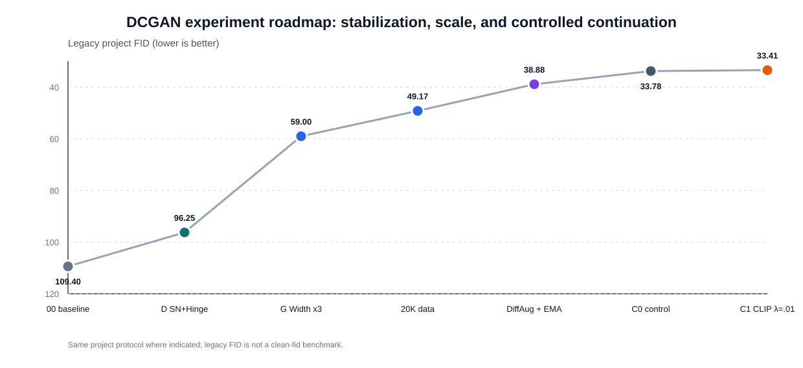

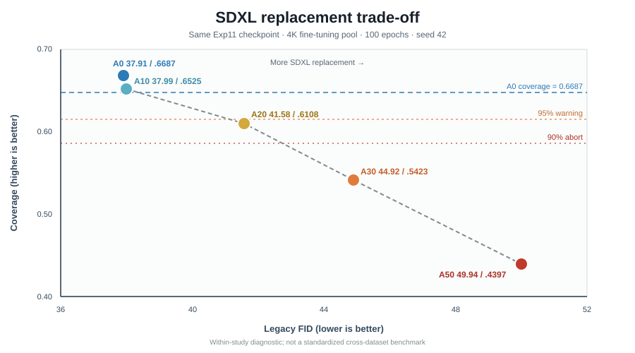

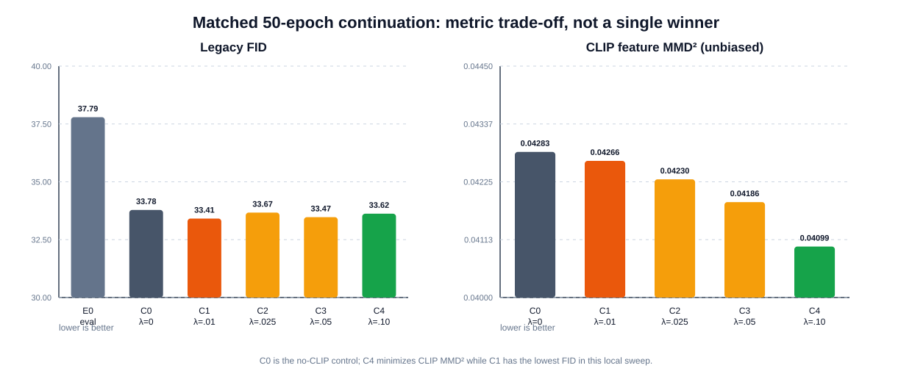

### Qualitative samples

The original long contact sheet was split into stage-level cards so the progression is easier to scan. The first Phase 2 card is the plain no-added-module baseline, not the later Width x3 model.

<table>
  <tr>
    <td align="center"><b>Phase 1: epoch budget</b> 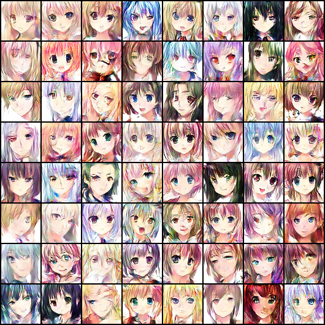</td>
    <td align="center"><b>Phase 1: augmentation</b> 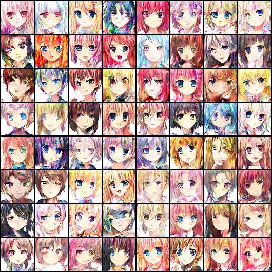</td>
    <td align="center"><b>Phase 2: plain baseline</b> 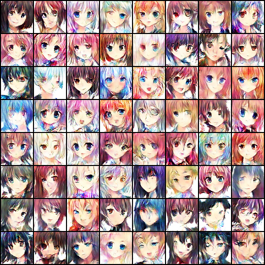</td>
  </tr>
  <tr>
    <td align="center"><b>Phase 2: D stabilization</b> 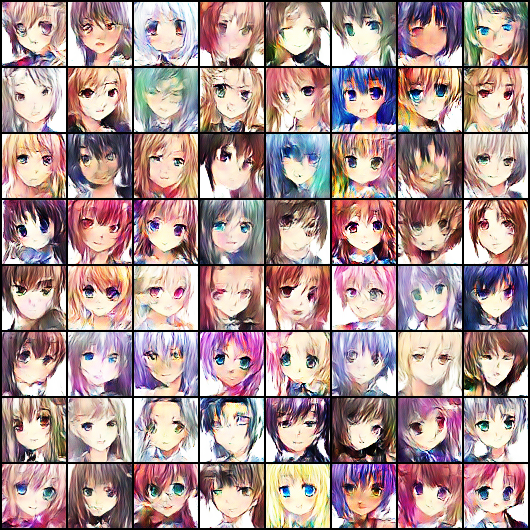</td>
    <td align="center"><b>Phase 3: generator width</b> 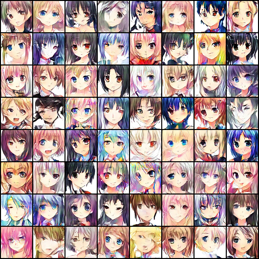</td>
    <td align="center"><b>Phase 3: DiffAugment + EMA</b> 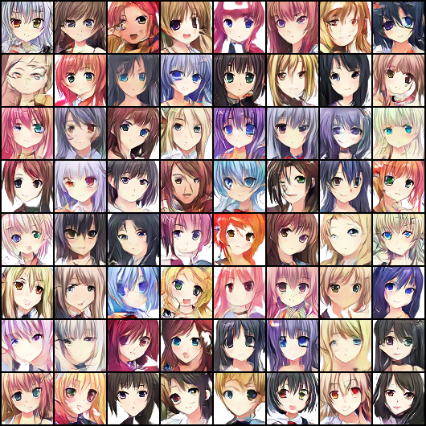</td>
  </tr>
  <tr>
    <td align="center"><b>Phase 5: CLIP continuation</b> 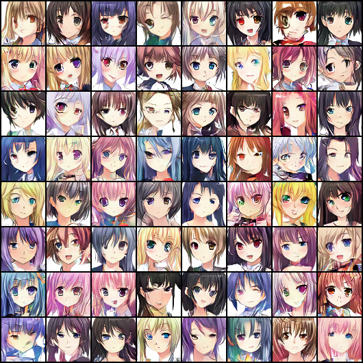</td>
    <td align="center"><b>Phase 6: clean-unique data</b> 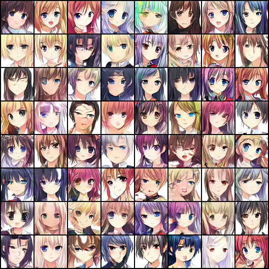</td>
    <td align="center"><b>Phase 7: controlled SDXL study</b> 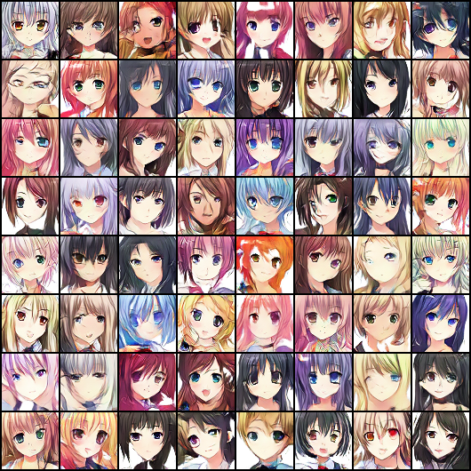</td>
  </tr>
</table>

The full compact montage remains available as [`qualitative_samples_compact.png`](04_visual_assets/qualitative_samples_compact.png) for reviewers who want a single downloadable artifact.

The SDXL pilot is preserved separately because it documents the synthetic-data candidate pool and the cleaning workflow:

SDXL pilot provenance (not shown inline)

The pilot contact sheet is kept as a downloadable artifact because it documents the synthetic-data candidate pool and the cleaning workflow. It is intentionally not rendered in the README gallery.

- [Download the pilot contact sheet](04_visual_assets/sdxl_pilot_contact_sheet.jpg)
- [Data audit and cleaning notes](docs/data_quality_and_sdxl_extension.md)
- [Controlled replacement protocol](docs/sdxl_controlled_study.md)

## Metric comparability

Short answer: no. The project uses one broad historical FID family for much of the DCGAN work, but the data pool, continuation setting, sample counts, and auxiliary metrics change across stages.

| Scope | Comparable metric | What changes or limits comparison |
|---|---|---|
| Phase 1 to Phase 5 legacy FID | Project Inception-v3 pool3 FID; historical 10K-real/10K-fake path | Dataset size, training objective, continuation state, and experiment purpose differ; use only inside the named comparison scope |
| Phase 5 CLIP sweep | Same legacy FID plus CLIP-MMD on 2K CLIP features | CLIP-MMD is a separate distribution metric; C0 is the required no-CLIP control |
| Phase 6 B1 | Same legacy FID implementation | Training pool changes to 17,029 exact-unique contents, so it is a data-quality baseline, not an architecture win |
| Phase 7 A0-A50 | Same legacy FID code path plus Coverage | Up to 4K real vs 5K fake features; valid for within-study ranking only, not a standardized benchmark |
| LPIPS, Diversity, Laplacian, Edge Density, D logits | Supporting diagnostics | Definitions and loss functions vary; none is a universal replacement for FID |

## Metric boundaries

The headline field is fid_legacy_project, not a standardized benchmark. Historical runs use the project's torchvision Inception-v3 pool3 pipeline, with protocol details changing by phase. Phase 7 uses the same code path for all A0-A50 groups, but its evaluation code collects up to 4,000 real images from the 4K pool and 5,000 fake images; this asymmetry is documented and means the values should only be used for within-study ranking.

The older LPIPS field is an AlexNet feature-distance proxy, not calibrated LPIPS. CLIP-MMD is a separate distribution metric. Coverage, blur rate, Laplacian variance, and edge density are supporting diagnostics. See [metric_protocol.md](metric_protocol.md) and [docs/reproduction_boundary.md](docs/reproduction_boundary.md).

Known limitations:

- most comparisons use one seed and one evaluation draw;
- real images are primarily from the training distribution, not a strict holdout;
- historical metrics are not directly comparable to clean-fid or torch-fidelity;
- Phase 7 discriminator evaluation logits include an A0 anomaly and are excluded from headline conclusions;
- the project does not claim novelty, SOTA performance, or causal separation of DiffAugment versus EMA.

## Reproduction boundary

This is a Kaggle experiment archive:

- the dataset is not included;
- model weights and large checkpoints stay outside Git history;
- representative entry points expect Kaggle Input datasets and GPU/Internet settings;
- requirements.txt is a compatibility floor, not a lockfile;
- the snapshot checks validate evidence files without requiring a GPU.

    python -m unittest discover -s tests -v

For the ongoing update process, use [UPDATE_WORKFLOW.md](UPDATE_WORKFLOW.md). For the one-month audit, claims, resume bullets, and interview framing, see [docs/month1_audit_2026-08.md](docs/month1_audit_2026-08.md) and [docs/interview_playbook.md](docs/interview_playbook.md). The next deployment phase is planned in [docs/next_phase_deployment_plan.md](docs/next_phase_deployment_plan.md).

## Repository map

| Path | Purpose |
|---|---|
| 01_public_core/ | Public baseline, Exp11 recipe, and data-audit entry points |
| 02_selected_experiments/ | Selected scripts plus the complete staged source archive |
| 03_metrics_and_logs/ | Curated JSON metrics and CSV training logs |
| 04_visual_assets/ | Interview figures, sample grids, and SDXL visual evidence |
| docs/ | Protocols, limitations, project story, audit, and interview guidance |
| tests/ | CPU-only snapshot integrity checks |
| tools/ | Figure and evidence utilities |

## Interview-ready one-minute summary

> I ran a resource-constrained PyTorch DCGAN study in Kaggle for unconditional 64x64 anime-face generation. I structured the work as staged ablations: first selecting a practical epoch and augmentation budget, then using a no-added-module DCGAN as the architectural control for attention, frequency, edge, and discriminator-stabilization tests. I next tested generator capacity and data scale, then froze a Width x3, 20K-image recipe with DiffAugment and EMA. A matched CLIP-MMD continuation sweep showed that the best local legacy FID and the best CLIP-MMD did not select the same setting. After auditing 21,551 paths down to 17,029 unique SHA-256 contents, I designed a fixed-budget SDXL replacement study. The tested synthetic pool failed to improve FID or coverage, so I preserved the negative result and its stopping rule. The project's main limitation is that it remains Kaggle-only with legacy, mostly single-seed evaluation.

## Status

Public technical-review snapshot, updated 2026-08-10. The internship work remains ongoing; future experiments should be added as scoped, dated evidence rather than rewritten history.
