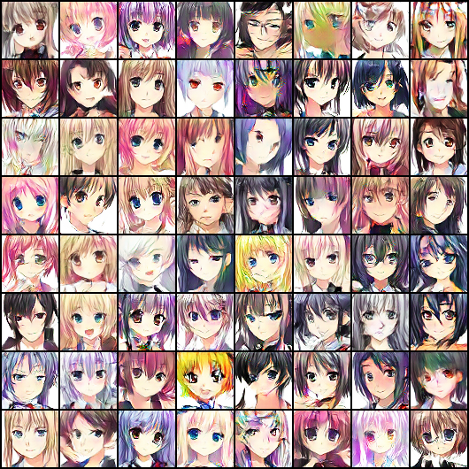
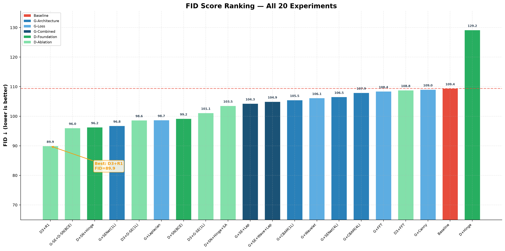
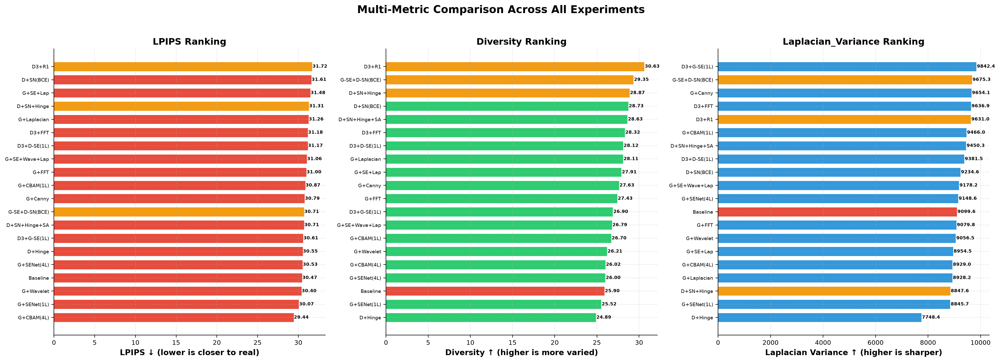

# Resource-Constrained DCGAN for Anime Face Generation


This folder is a frozen, interview- and GitHub-oriented snapshot of an ongoing DCGAN project. It is a curated copy of selected code, metrics, visual evidence, and model artifacts as of 2026-08-04. The active research workspace remains separate and must continue to be treated as the source of truth for new experiments.

This is intentionally a work-in-progress research engineering repository, not a claim of state-of-the-art image generation. The public-facing goal is to make the experimental reasoning, evaluation assumptions, and engineering trade-offs easy to inspect.

## Project focus

The project studies 64x64 anime-face generation with PyTorch under limited Kaggle GPU resources. The experiments cover:

- standard DCGAN and SNGAN-style discriminator stabilization;
- Hinge loss and spectral normalization;
- Generator capacity scaling;
- data-size scaling from 10K to 20K images;
- DiffAugment and exponential moving average (EMA);
- CLIP image-feature distribution matching with an MMD objective.

## Selected evidence

| Milestone | Project-protocol FID |
|---|---:|
| Initial baseline | 109.40 |
| SN + Hinge discriminator | 96.25 |
| Generator Width x3 | 59.00 |
| Width x3 with 20K images | 49.17 |
| DiffAugment + EMA | 38.88 |
| CLIP MMD, lambda=0.01 | 33.4114 |

## Visual overview

### Generated samples

| Milestone | Samples |
|---|---|
| Width x3 |  |
| 20K images |  |
| DiffAugment + EMA |  |

### Evaluation overview





The visual results are 64x64 generated grids. They are useful for qualitative comparison, but they do not replace distributional evaluation or a holdout-set analysis.

## Important metric caveat

These FID values are valid for longitudinal comparison inside this project, but they are not presented as clean-fid or published benchmark values. The project uses a legacy torchvision Inception-v3 feature pipeline, and historical experiments primarily evaluate against the training image distribution rather than a strict unseen holdout set. Future experiments should preserve this protocol for continuity while adding a separately named standardized FID protocol.

## Snapshot layout

- `01_public_core/`: baseline, final Exp11 code, and explanatory notes.
- `02_selected_experiments/`: representative ablations, not every historical script.
- `03_metrics_and_logs/`: JSON metrics and CSV logs only.
- `04_visual_assets/`: selected samples and comparison figures.
- `05_interview_materials/`: resume and interview framing notes.
- `06_model_artifacts/`: local frozen weights; do not commit blindly to GitHub.
- `99_source_map/`: source-to-snapshot mapping and freeze status.

## Reproduction status

The frozen experiment files are currently self-contained Kaggle-oriented scripts, reflecting the original internship workflow. They are preserved for provenance and review. A later public release should add a unified local CLI for training, evaluation, and sampling instead of requiring manual notebook copy/paste.

```text
pip install -r requirements.txt
```

The dataset is not included. A future public release should document a permitted dataset source and a fixed train/holdout manifest.

## What I learned

- Increasing Generator capacity helped until the adversarial balance broke down.
- Increasing data diversity produced a larger improvement than several more complex Generator variants.
- DiffAugment and EMA improved the selected 20K baseline under the legacy project protocol.
- Some residual, attention, and auxiliary-loss variants were negative results under the batch-size and GPU constraints.
- FID is useful but incomplete; diversity, edge statistics, blur rate, CLIP feature distribution, and visual inspection are complementary.

## Publication rule

Do not upload raw datasets, private internship material, internal work logs, or all checkpoint files without verifying ownership and licensing. For a public GitHub repository, keep the code and small evidence files in Git, and distribute large weights through a release or model-hosting service with checksums.

## License status

The license is intentionally pending until internship ownership, dataset licensing, and model-weight redistribution rights are confirmed. See `LICENSE_DECISION.md`.
