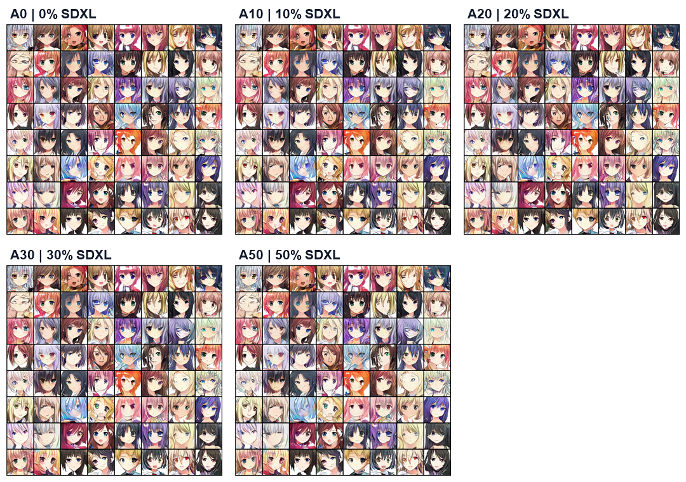

# Phase 7: controlled SDXL replacement study

## Research question

Can a cleaned synthetic image pool from Animagine XL 4.0 replace part of the original Anime Faces data during fine-tuning without reducing distributional quality or feature coverage?

## Comparison boundary

This is a separate `phase7_4k_finetune` scope. Every group:

- starts from the same Exp11 pretrained Generator and Discriminator checkpoint;
- uses a fixed 4,000-image training pool;
- fine-tunes for 100 epochs with seed 42, batch size 32, `lr=1e-4`, and Adam `(0.5, 0.99)`;
- keeps Width ×3 Generator, SN-Hinge Discriminator, DiffAugment, and EMA fixed;
- changes only the original/SDXL replacement ratio.

It is not directly comparable with the 20K path-based Exp11 run or the 17,029-unique-content B1 run. The Phase 7 code uses up to 4K real and 5K fake Inception features because N_FID is 5000 while the fine-tuning pool contains 4K images; Coverage is a project-defined Inception-feature diagnostic.

## Results

  

| Group | Original | SDXL | Legacy FID | Coverage | Diversity | Blur rate |
|---|---:|---:|---:|---:|---:|---:|
| A0 | 4,000 | 0 | 37.91 | 0.6687 | 28.8269 | 0.125 |
| A10 | 3,600 | 400 | 37.99 | 0.6525 | 30.3359 | 0.095 |
| A20 | 3,200 | 800 | 41.58 | 0.6108 | 30.1304 | 0.070 |
| A30 | 2,800 | 1,200 | 44.92 | 0.5423 | 30.3333 | 0.100 |
| A50 | 2,000 | 2,000 | 49.94 | 0.4397 | 29.6052 | 0.095 |

## Interpretation

The result is negative for the tested synthetic pool. A0 is the best FID and Coverage control. A10 is approximately neutral in FID but already loses Coverage. A20 enters the Coverage warning region, while A30 and A50 cross the project’s Coverage abort threshold. The trend does not support claiming that adding more SDXL images improves the DCGAN.

The appropriate interview conclusion is:

> I tested synthetic-data replacement under a fixed fine-tuning budget and found that the tested SDXL distribution introduced a mismatch with the target Anime Faces distribution. Increasing the synthetic ratio reduced feature coverage and worsened legacy FID, so I stopped treating SDXL augmentation as an automatic improvement.

## Evidence and limitations

- The five metric JSON files and loss logs are under `03_metrics_and_logs/phase7_sdxl_controlled_study/`.
- The corresponding Kaggle source scripts are under `02_selected_experiments/full_process/phase7_sdxl_controlled_study/`.
- Representative epoch-100 grids are under `04_visual_assets/sdxl_*_epoch100.png`.
- The pilot review CSV is preserved under `03_metrics_and_logs/phase7_sdxl_controlled_study/pilot/`.
- The pilot CSV has blank row-level `manual_keep` fields in the public snapshot, so it is provenance/template evidence, not a complete semantic annotation audit.
- All results use one seed and legacy/project-defined metrics; no statistical significance claim is made.
- The generated SDXL images, zip archives, model weights, and private Kaggle inputs remain outside Git history.

## Next decision

Do not run more high-ratio mixtures solely to obtain a better-looking result. If synthetic-data work continues, first freeze a row-level accepted manifest, compare the accepted pool’s style/feature distribution with the original pool, and either redesign the SDXL generation process or document this negative result as the stopping point.
